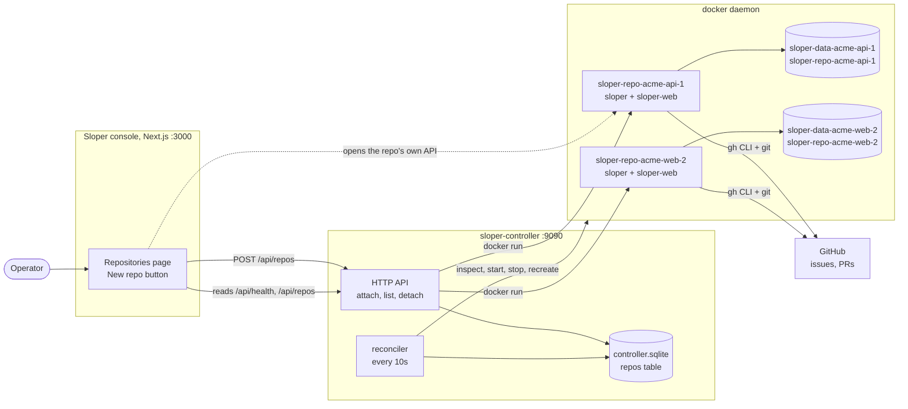
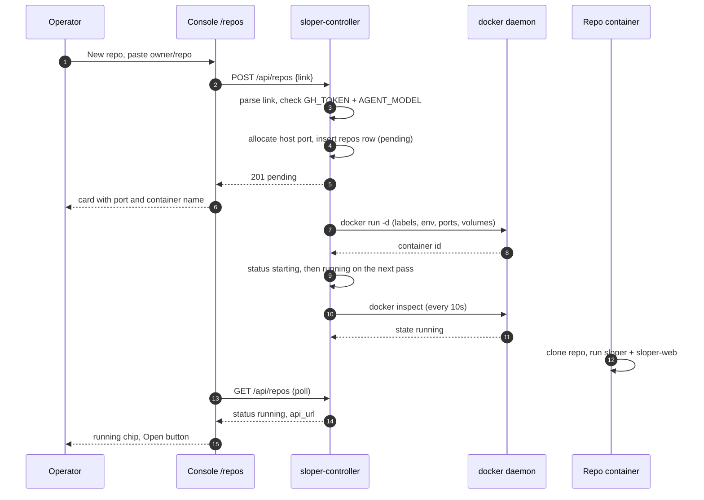

# The repo controller — one docker instance per attached repo

`sloper-controller` is the multi-repo backend. You give it a repo link; it gives
that repo its own sloper instance: a docker container running the sloper image,
with its own clone, its own SQLite pipeline database, its own worktrees and its
own dashboard API port. The console's **Repositories** page is a thin UI over
the same API.

Before this, one sloper deployment meant one repo: `GH_REPO_LINK` was baked into
the container and the port came from compose. Now the set of repos is data — a
`repos` table — and the controller reconciles containers against it.



**Ground truth.** `app/controller` builds one `controller.Service`
(`internal/controller`) over a `storage.Repositories` and a `docker.Client`
(`internal/docker`, a typed wrapper around the `docker` CLI). Attaching writes a
row, allocates a host port and kicks the reconciler; the reconciler is the only
code that calls `docker run`. Each container is labeled `sloper.managed=true`
and `sloper.repo=<owner/repo>`, inherits the controller's GitHub and agent
credentials, publishes its sloper-web port on the host, and mounts two named
volumes (data at `/root/.sloper`, clone at `/root/repo`). Nothing else in sloper
changed: a repo container is the same sloper + sloper-web pair that
`setup/compose.yml` runs.

## Attach flow



## API

Every route is JSON. With `SLOPER_CONTROLLER_TOKEN` set, each request needs
`Authorization: Bearer <token>`.

| Method | Route | What it does |
| --- | --- | --- |
| `GET` | `/api/health` | Controller version, uptime, docker reachability, image, repo counts |
| `GET` | `/api/repos` | Every attached repo with its last observed container state |
| `POST` | `/api/repos` | Attach `{"link": "owner/repo"}`; returns the row in `pending` |
| `GET` | `/api/repos/{id}` | One repo |
| `PATCH` | `/api/repos/{id}` | `{"desired_state": "running" \| "stopped"}` |
| `DELETE` | `/api/repos/{id}?purge=true` | Remove the container; `purge` also deletes its volumes |
| `POST` | `/api/repos/{id}/restart` | Stop, remove and recreate the container (volumes kept) |
| `GET` | `/api/repos/{id}/logs?tail=200` | Tail of the container log |

Links are accepted as `owner/repo`, `github.com/owner/repo`,
`https://github.com/owner/repo(.git)` or `git@github.com:owner/repo.git`. Only
GitHub is accepted, because everything downstream (gh CLI, issues, PRs) is.
Status codes: `400` bad link or missing controller configuration, `409` already
attached, `404` unknown repo, `503` docker is unreachable.

## Running it

On a host with the docker daemon and the sloper image:

```bash
make build-agent-image   # builds sloper + sloper-web and tags sloper-agent:latest
export GH_TOKEN=$(gh auth token)
export GH_USERNAME=your-bot
export AGENT_MODEL=anthropic/claude-sonnet-4-20250514
export AGENT_KEY=...
make run-controller      # sloper-controller on 127.0.0.1:9090
```

`build-agent-image` is `make build-docker` plus
`docker tag setup-looper-service sloper-agent:latest`, so the image the
compose setup builds is the image the controller runs. If you build the image
under another name, point `SLOPER_IMAGE` at it.

Then open the console, **Repositories** → **New repo**, paste a link. The
container appears on the next free port in `SLOPER_PORT_RANGE` (default
`8080-8180`), and the console registers that address as an instance so you can
switch to it or press **Open**.

### Configuration

| Variable | Default | Meaning |
| --- | --- | --- |
| `SLOPER_CONTROLLER_ADDR` | `127.0.0.1` | Address the controller API binds. Anything but a loopback address requires `SLOPER_CONTROLLER_TOKEN`; the process refuses to start otherwise |
| `SLOPER_CONTROLLER_PORT` | `9090` | Port the controller API binds |
| `SLOPER_CONTROLLER_TOKEN` | empty | Require a bearer token; set it whenever the API is reachable beyond localhost |
| `SLOPER_CONTROLLER_DB_PATH` | `~/.sloper/controller.sqlite` | Registry of attached repos |
| `SLOPER_CONTROLLER_LOG_DIR` | `~/.sloper/controller-logs` | Rotating controller log |
| `SLOPER_CONTROLLER_RECONCILE_SECONDS` | `10` | Reconcile cadence |
| `SLOPER_IMAGE` | `sloper-agent:latest` | Image each repo container runs |
| `SLOPER_PORT_RANGE` | `8080-8180` | Host ports handed out, one per repo |
| `SLOPER_PUBLISH_ADDR` | `127.0.0.1` | Address those ports are published on |
| `SLOPER_PUBLIC_HOST` | `localhost` | Host the console should use to reach them |
| `SLOPER_NETWORK` | empty | Optional docker network for repo containers |
| `SLOPER_RESTART_POLICY` | `unless-stopped` | Docker restart policy |
| `NEXT_PUBLIC_SLOPER_CONTROLLER_URL` | `http://localhost:9090` | Console default; changeable per browser on the Repositories page |

Inherited by every repo container (and required for attach): `GH_TOKEN`,
`AGENT_MODEL`. Also passed through when set: `GH_USERNAME`, `GH_EMAIL`,
`AGENT_KEY`, `AGENT_PROVIDER`, `AGENT_API`, `SLOPER_WEB_TOKEN`. An attach is
refused with `400` while `GH_TOKEN` or `AGENT_MODEL` is missing, because the
container could not clone the repo or run the agent. `GH_USERNAME` and
`GH_EMAIL` are not required to attach, but the container's entrypoint makes them
the commit identity, so the controller logs a warning when they are unset —
without them every agent commit fails.

## Lifecycle rules

- **Naming** — container `sloper-repo-<slug>-<hash>`, volumes
  `sloper-data-<slug>-<hash>` (mounted at `/root/.sloper`) and
  `sloper-repo-<slug>-<hash>` (mounted at `/root/repo`), where `<hash>` is a
  short hash of the repo link. The names derive from the link, not from the row
  id, so detaching and re-attaching a repo lands on the same clone, worktrees
  and pipeline database.
- **Ports** — the first free port in the range that no row holds; `docker run`
  claims it for the life of the container.
- **Reconcile** — desired `running`: create what is missing, start what is
  stopped, recreate a container that exists but cannot be started. A container
  that keeps exiting is restarted and its exit code is surfaced on the card
  (`restarted N×`), so a crash loop never hides behind a silent "starting".
  Desired `stopped`: stop the container but keep it (and its row) so it can be
  started again. Every pass writes the observed state back for the console.
- **Image pulls** — a missing image is pulled in the background instead of
  blocking the loop; a failed pull is remembered for two minutes so a wrong
  image name does not hammer the registry. **Restart** clears that memory, which
  is the retry button after you build the image.
- **Detach** — stops and removes the container, deletes the row, keeps the
  volumes. `?purge=true` (the "delete its data" checkbox) removes them too.
- **Orphans** — a managed container with no row is logged at startup and left
  alone; the controller never deletes containers it cannot account for.

## Tests

```bash
go test ./internal/controller/... ./internal/docker/...   # unit, no docker needed
make controller-e2e                                       # real docker daemon
```

`tools/controller-e2e.sh` runs the whole lifecycle against a throwaway
controller: it builds a stand-in image from a locally available base, attaches
two repos, asserts with `docker inspect` that each one got a container, its own
published port, inherited credentials, labels and per-repo volumes, then stops,
restarts and detaches — cleaning up only the containers and volumes it created.
Point `SLOPER_E2E_IMAGE` at the real sloper image to run the same flow against
production containers.

## Containerized controller

To run the controller itself in docker, give it the docker socket, the parent
`~/.sloper` for the repo registry, and a published port:

```yaml
services:
  controller:
    image: sloper-agent:latest
    entrypoint: ["/usr/local/bin/sloper-controller"]
    environment:
      SLOPER_CONTROLLER_ADDR: 0.0.0.0
      SLOPER_CONTROLLER_PORT: "9090"
      SLOPER_CONTROLLER_TOKEN: ${SLOPER_CONTROLLER_TOKEN}
      SLOPER_PUBLIC_HOST: ${SLOPER_PUBLIC_HOST:-localhost}
      GH_TOKEN: ${GH_TOKEN}
      GH_USERNAME: ${GH_USERNAME}
      AGENT_MODEL: ${AGENT_MODEL}
      AGENT_KEY: ${AGENT_KEY}
    volumes:
      - /var/run/docker.sock:/var/run/docker.sock
      - controller_data:/root/.sloper
    ports:
      - "9090:9090"
      - "8080-8180:8080-8180"

volumes:
  controller_data:
```

Publishing the port range is what lets the browser reach each repo's
sloper-web; keep `SLOPER_PUBLISH_ADDR` and `SLOPER_PUBLIC_HOST` consistent with
where the console runs. Mounting the docker socket hands the controller root on
the host, so protect its API with `SLOPER_CONTROLLER_TOKEN`.
