# Sloper — the whole project in Mermaid diagrams

Sloper is a Go orchestrator that drives a coding agent (`pi`) over a GitHub repo:
it discovers issues, specs them, implements them in git worktrees, opens PRs,
self-reviews them, fixes what the review found, and lets a human merge.

This document maps every moving part in 24 diagrams across 22 sections. Each
diagram is followed by the **ground truth** it encodes, so a reader (or a
validation agent) can check the diagram against the source. A validation log at
the end records, per diagram, what an independent agent understood from the
diagram alone and whether that matches.

Everything below renders on github.com. Diagrams 10 and 12 were split after
validation (into 10a/10b and 12a/12b) and 11 was trimmed, purely because
GitHub's renderer gave up on the larger versions; no claims changed.

> **If you edit a diagram:** GitHub's Mermaid is older and stricter than the
> renderer in most editors. It rejects a semicolon inside a sequence-diagram
> message (it is a statement separator) and a colon inside a state-diagram
> transition label. All 24 diagrams here parse clean under both `mermaid@10.9.1`
> and `mermaid@11.17.2`; keep it that way if you touch them.

| # | Diagram | Type | Covers |
| --- | --- | --- | --- |
| 1 | System context | flowchart LR | Every process, store and external service |
| 2 | Go package graph | flowchart TD | Package-level dependencies |
| 3 | Runtime topology | flowchart LR | Host vs container, volumes, ports |
| 4 | Scheduler tick loop | flowchart TD | The 60-second heartbeat |
| 5 | `processOne` triage tree | flowchart TD | New issue vs comment vs slash command |
| 6 | Issue stage machine | stateDiagram-v2 | `issues.stage` transitions |
| 7 | Stage pipeline + fix loop | flowchart LR | SPEC → WORK → REVIEW → FIX → merge |
| 8 | Agent RPC session | sequenceDiagram | `pi --mode rpc` over stdio JSONL |
| 9 | Agent output parsing | flowchart LR | Prompt → text → fenced JSON → struct |
| 10 | Domain model (10a + 10b) | classDiagram | Rows, stage results and read models |
| 11 | Worktree lifecycle | stateDiagram-v2 | work / review / fix worktrees |
| 12 | Git + GitHub surface (12a + 12b) | flowchart LR | Every `gh` and `git` call, retries and their absence |
| 13 | SQLite schema | erDiagram | Tables, columns, foreign keys |
| 14 | Runs & events ledger | flowchart LR | Crash recovery and the audit trail |
| 15 | `sloper-web` API surface | mindmap | 16 read-only routes |
| 16 | Console architecture | flowchart TD | Routes → components → hooks → API |
| 17 | Session streaming protocol | sequenceDiagram | Initial window, incremental polls, scrollback |
| 18 | Session summary pipeline | flowchart LR | File → entries → summary → "current activity" |
| 19 | Build, validate, tooling | flowchart LR | Makefile, validate.sh, pre-PR hook |
| 20 | Configuration map | flowchart LR | Env var → consumer |
| 21 | Operator journey | journey | What a maintainer experiences |
| 22 | Repo timeline | timeline | 68 commits, June → October |

---

## 1. System context — every process and store

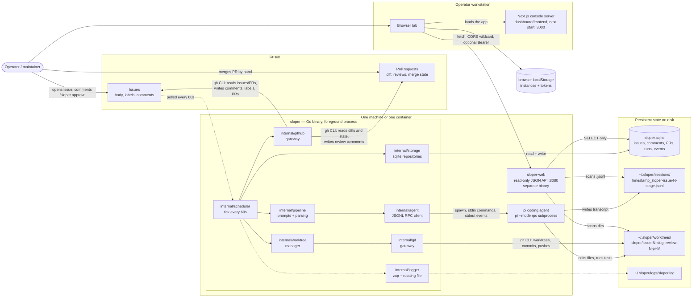
```mermaid
flowchart LR
    OP(["Operator / maintainer"])

    subgraph GITHUB["GitHub"]
        ISS["Issues<br/>body, labels, comments"]
        PRS["Pull requests<br/>diff, reviews, merge state"]
    end

    subgraph MACHINE["One machine or one container"]
        subgraph SLOPER["sloper — Go binary, foreground process"]
            SCHED["internal/scheduler<br/>tick every 60s"]
            PIPE["internal/pipeline<br/>prompts + parsing"]
            AGW["internal/agent<br/>JSONL RPC client"]
            STORE["internal/storage<br/>sqlite repositories"]
            WTM["internal/worktree<br/>manager"]
            GITG["internal/git<br/>gateway"]
            GHG["internal/github<br/>gateway"]
            LOGZ["internal/logger<br/>zap + rotating file"]
        end
        PI["pi coding agent<br/>pi --mode rpc subprocess"]
        WEB["sloper-web<br/>read-only JSON API :8080<br/>separate binary"]
    end

    subgraph WORKSTATION["Operator workstation"]
        CONSOLE["Next.js console server<br/>dashboard/frontend, next start :3000"]
        BROWSER["Browser tab"]
    end

    subgraph DISK["Persistent state on disk"]
        DB[("sloper.sqlite<br/>issues, comments, PRs, runs, events")]
        SESSF["~/.sloper/sessions/<br/>timestamp_sloper-issue-N-stage.jsonl"]
        WTDIR["~/.sloper/worktrees/<br/>sloper/issue-N-slug, review-N-pr-M"]
        LOGF["~/.sloper/logs/sloper.log"]
    end

    LS[("browser localStorage<br/>instances + tokens")]

    OP -->|"opens issue, comments /sloper approve"| ISS
    OP -->|"merges PR by hand"| PRS
    OP --> BROWSER
    BROWSER -->|"loads the app"| CONSOLE

    ISS -.->|"polled every 60s"| SCHED
    GHG -->|"gh CLI: reads issues/PRs,<br/>writes comments, labels, PRs"| ISS
    GHG -->|"gh CLI: reads diffs and state,<br/>writes review comments"| PRS
    SCHED --> GHG
    SCHED --> PIPE
    PIPE --> AGW
    AGW -->|"spawn, stdin commands, stdout events"| PI
    PI -->|"edits files, runs tests"| WTDIR
    PI -->|"writes transcript"| SESSF
    SCHED --> WTM
    WTM --> GITG
    GITG -->|"git CLI: worktrees, commits, pushes"| WTDIR
    SCHED --> STORE
    STORE -->|"read + write"| DB
    SCHED -.-> LOGZ
    LOGZ -.-> LOGF

    WEB -->|"SELECT only"| DB
    WEB -->|"scans .jsonl"| SESSF
    WEB -->|"scans dirs"| WTDIR
    BROWSER -->|"fetch, CORS wildcard, optional Bearer"| WEB
    BROWSER --> LS
```

**Ground truth.** `sloper` is a foreground process (`app/sloper/main.go`) that
starts one `runtime.Runtime`, which opens the DB, migrates it, recovers
interrupted runs, prunes worktrees and hands control to `scheduler.Start`. The
scheduler is the only writer of pipeline state. Every external effect goes
through a subprocess: `gh` (issues/PRs), `git` (worktrees, commits, pushes) and
`pi` (the agent). `sloper-web` is a *separate binary* that only reads the same
SQLite file, the session directory and the worktree directory — it never writes
and never talks to GitHub. The console is a pure frontend that fetches each
instance's API directly from the browser; it stores its instance registry and
tokens in `localStorage`. There is no webhook, no queue, no daemon: discovery is
a 60-second poll of `gh issue list`.

---

## 2. Go package graph

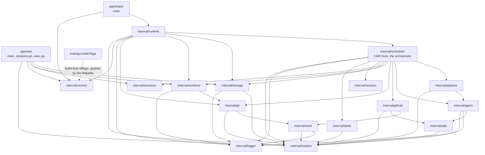
```mermaid
flowchart TD
    SLOPER["app/sloper<br/>main"]
    WEB["app/web<br/>main, sessions.go, exec.go"]

    RT["internal/runtime"]
    SCH["internal/scheduler<br/>1345 lines, the orchestrator"]
    PL["internal/pipeline"]
    AG["internal/agent"]
    GH["internal/github"]
    GIT["internal/git"]
    SH["internal/shell"]
    WT["internal/worktree"]
    SES["internal/sessions"]
    CLEAN["internal/session"]
    SLASH["internal/slash"]
    ST["internal/storage"]
    MOD["internal/models"]
    UTL["internal/utils"]
    LOG["internal/logger"]
    VER["internal/version"]
    FLAGS["tools/go-build-flags"]

    SLOPER --> RT
    SLOPER --> VER
    RT --> SCH
    RT --> ST
    RT --> WT
    RT --> GIT
    RT --> LOG
    RT --> VER
    RT --> MOD

    SCH --> PL
    SCH --> AG
    SCH --> GH
    SCH --> GIT
    SCH --> WT
    SCH --> ST
    SCH --> SES
    SCH --> CLEAN
    SCH --> SLASH
    SCH --> LOG
    SCH --> MOD

    PL --> AG
    PL --> MOD
    AG --> UTL
    AG --> LOG
    AG --> MOD
    GH --> SH
    GH --> UTL
    GH --> MOD
    GIT --> SH
    GIT --> MOD
    SH --> LOG
    SH --> MOD
    WT --> GIT
    WT --> LOG

    ST --> MOD
    ST --> LOG
    SLASH --> MOD
    UTL --> MOD

    WEB --> ST
    WEB --> SES
    WEB --> WT
    WEB --> VER
    WEB --> MOD

    FLAGS -.->|"build-time ldflags, applied by the Makefile"| VER
```

*Reading the arrows: a solid arrow means "imports"; the dashed arrow is a
build-time injection, not an import. `app/web` is a second binary that shares
only the storage, sessions and worktree packages with the orchestrator — it
never imports `runtime` or `scheduler`, which is why it can serve a database
that another process is writing.*

**Ground truth.** `internal/sessions` is deliberately standalone (stdlib only:
`bufio`, `encoding/json`, `os`) so session parsing can be tested without a
database. `internal/storage` embeds its migrations with `//go:embed
migrations/*.sql` and is the only package that imports a driver
(`modernc.org/sqlite`, pure Go). `internal/models` is a leaf everywhere — it
holds the enums (`StageNew`, `StageMerged`, …), `MaxReviewIterations = 3`,
option structs and error types. The scheduler is the hub: 11 internal imports.
Test packages exist for `app/web`, `internal/agent`, `internal/pipeline`,
`internal/scheduler`, `internal/sessions`, `internal/slash`,
`internal/worktree` (`go test ./...` passes as of this writing).

---

## 3. Runtime topology — host vs container

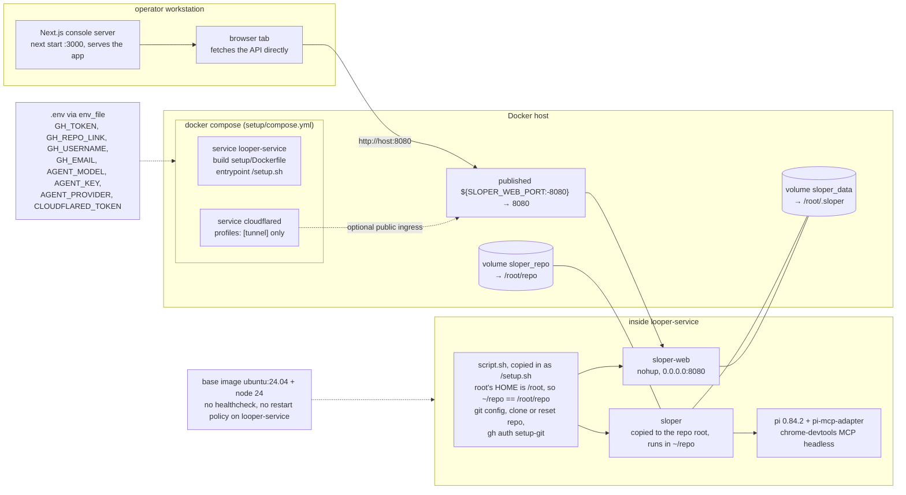
```mermaid
flowchart LR
    subgraph WORKSTATION["operator workstation"]
        CS["Next.js console server<br/>next start :3000, serves the app"]
        BR["browser tab<br/>fetches the API directly"]
        CS --> BR
    end

    subgraph DOCKERHOST["Docker host"]
        subgraph COMPOSE["docker compose (setup/compose.yml)"]
            LS["service looper-service<br/>build setup/Dockerfile<br/>entrypoint /setup.sh"]
            CF["service cloudflared<br/>profiles: [tunnel] only"]
        end
        VOL1[("volume sloper_data<br/>→ /root/.sloper")]
        VOL2[("volume sloper_repo<br/>→ /root/repo")]
        PORT["published ${SLOPER_WEB_PORT:-8080} → 8080"]
    end

    subgraph INNER["inside looper-service"]
        SETUP["script.sh, copied in as /setup.sh<br/>root's HOME is /root, so ~/repo == /root/repo<br/>git config, clone or reset repo,<br/>gh auth setup-git"]
        SW["sloper-web<br/>nohup, 0.0.0.0:8080"]
        SB["sloper<br/>copied to the repo root, runs in ~/repo"]
        PIB["pi 0.84.2 + pi-mcp-adapter<br/>chrome-devtools MCP headless"]
    end

    BR -->|"http://host:8080"| PORT
    PORT --> SW
    SETUP --> SW
    SETUP --> SB
    SB --> PIB
    SB --- VOL1
    SW --- VOL1
    VOL2 --- SB
    CF -.->|"optional public ingress"| PORT

    ENVF[".env via env_file<br/>GH_TOKEN, GH_REPO_LINK, GH_USERNAME,<br/>GH_EMAIL, AGENT_MODEL, AGENT_KEY,<br/>AGENT_PROVIDER, CLOUDFLARED_TOKEN"] -.-> COMPOSE

    NOTE2["base image ubuntu:24.04 + node 24<br/>no healthcheck, no restart policy on looper-service"]
    NOTE2 -.-> INNER
```

**Ground truth.** The image is `ubuntu:24.04` plus `gh` (official apt repo),
Google Chrome (for the `chrome-devtools` MCP server), nvm + Node 24,
`@earendil-works/pi-coding-agent@0.84.2` symlinked to `/usr/local/bin/pi`,
`pi-mcp-adapter@2.26.1`, the skills copied to `/root/.pi/agent/skills/` and
`pi-mcp.json` to `/root/.pi/agent/mcp.json`. `setup/script.sh` runs as the
entrypoint: it sources nvm, sets git identity from `GH_USERNAME`/`GH_EMAIL`,
clones `GH_REPO_LINK` into `~/repo` (or `git fetch --all` + `reset --hard
origin/HEAD` + `git clean -fd` when it already exists), runs `gh auth
setup-git`, starts `sloper-web` with `nohup` bound to `0.0.0.0:8080`, then runs
`sloper` in the foreground. Two named volumes (`sloper_data` → `/root/.sloper`,
`sloper_repo` → `/root/repo`) keep the database, sessions and worktrees across
restarts. `cloudflared` only starts under `--profile tunnel` and needs
`CLOUDFLARED_TOKEN`. The console itself is *not* containerised — it is run
separately (`make run-dashboard`, port 3000) and points at instance URLs.

---

## 4. The scheduler tick loop

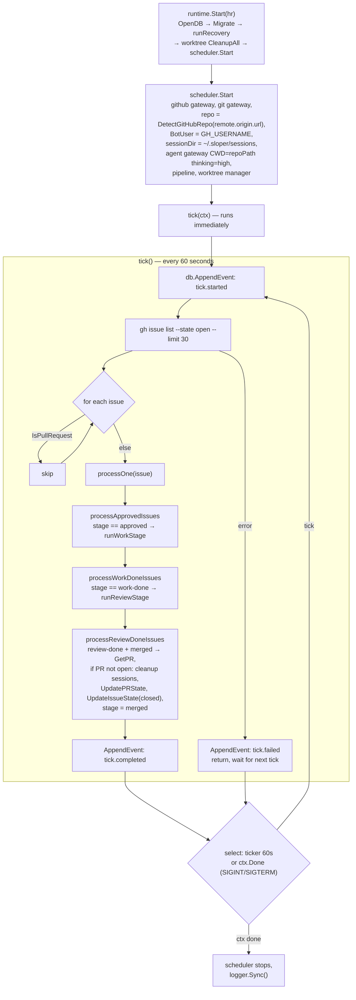
```mermaid
flowchart TD
    START["runtime.Start(hr)<br/>OpenDB → Migrate → runRecovery<br/>→ worktree CleanupAll → scheduler.Start"] --> INIT

    INIT["scheduler.Start<br/>github gateway, git gateway,<br/>repo = DetectGitHubRepo(remote.origin.url),<br/>BotUser = GH_USERNAME,<br/>sessionDir = ~/.sloper/sessions,<br/>agent gateway CWD=repoPath thinking=high,<br/>pipeline, worktree manager"] --> FIRST

    FIRST["tick(ctx) — runs immediately"] --> T1

    subgraph TICK["tick() — every 60 seconds"]
        T1["db.AppendEvent: tick.started"] --> LIST["gh issue list --state open --limit 30"]
        LIST -->|"error"| TFAIL["AppendEvent: tick.failed<br/>return, wait for next tick"]
        LIST --> EACH{"for each issue"}
        EACH -->|"IsPullRequest"| SKIP1["skip"]
        EACH -->|"else"| ONE["processOne(issue)"]
        ONE --> APPR["processApprovedIssues<br/>stage == approved → runWorkStage"]
        APPR --> WORKD["processWorkDoneIssues<br/>stage == work-done → runReviewStage"]
        WORKD --> REVD["processReviewDoneIssues<br/>review-done + merged → GetPR,<br/>if PR not open: cleanup sessions,<br/>UpdatePRState, UpdateIssueState(closed),<br/>stage = merged"]
        REVD --> TDONE["AppendEvent: tick.completed"]
    end

    TDONE --> WAIT{"select: ticker 60s<br/>or ctx.Done (SIGINT/SIGTERM)"}
    WAIT -->|"tick"| T1
    WAIT -->|"ctx done"| STOP["scheduler stops,<br/>logger.Sync()"]
    TFAIL --> WAIT
    SKIP1 --> EACH
```

**Ground truth.** `PollInterval = 60 * time.Second`; the first tick is
synchronous inside `Start`, before the ticker loop. Each tick is serial: every
open issue is processed one at a time by `processOne` (a failure there is logged
and the loop moves on), and only after that loop finishes do the three batch
passes run, in the fixed order approved → work-done → review-done. The arrows
`processOne → processApprovedIssues → processWorkDoneIssues →
processReviewDoneIssues` are therefore sequencing after the loop, not a chain
per issue. Every tick is bracketed by
`tick.started` / `tick.completed` (or `tick.failed`) rows in `event_logs`, which
is what the console's "last tick" indicator reads. A ctx cancellation between
issues stops the tick; work in flight is expected to be recovered on restart by
`runRecovery`, which flips every `runs.status = 'running'` row to `interrupted`
and emits `recovery.interrupted_run`.

---

## 5. `processOne` — the triage decision tree

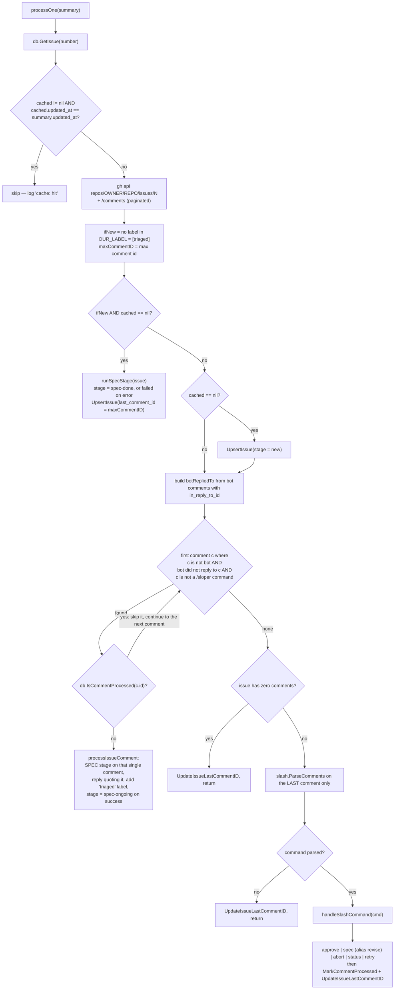
```mermaid
flowchart TD
    A["processOne(summary)"] --> B["db.GetIssue(number)"]
    B --> C{"cached != nil AND<br/>cached.updated_at == summary.updated_at?"}
    C -->|"yes"| C1["skip — log 'cache: hit'"]
    C -->|"no"| D["gh api repos/OWNER/REPO/issues/N<br/>+ /comments (paginated)"]
    D --> E["ifNew = no label in OUR_LABEL = [triaged]<br/>maxCommentID = max comment id"]
    E --> F{"ifNew AND cached == nil?"}
    F -->|"yes"| G["runSpecStage(issue)<br/>stage = spec-done, or failed on error<br/>UpsertIssue(last_comment_id = maxCommentID)"]
    F -->|"no"| H{"cached == nil?"}
    H -->|"yes"| H1["UpsertIssue(stage = new)"]
    H -->|"no"| I
    H1 --> I["build botRepliedTo from bot comments with in_reply_to_id"]
    I --> J{"first comment c where<br/>c is not bot AND<br/>bot did not reply to c AND<br/>c is not a /sloper command"}
    J -->|"found"| K{"db.IsCommentProcessed(c.id)?"}
    K -->|"yes: skip it, continue to the next comment"| J
    K -->|"no"| L["processIssueComment:<br/>SPEC stage on that single comment,<br/>reply quoting it, add 'triaged' label,<br/>stage = spec-ongoing on success"]
    J -->|"none"| M{"issue has zero comments?"}
    M -->|"yes"| M1["UpdateIssueLastCommentID, return"]
    M -->|"no"| N["slash.ParseComments on the LAST comment only"]
    N --> O{"command parsed?"}
    O -->|"no"| O1["UpdateIssueLastCommentID, return"]
    O -->|"yes"| P["handleSlashCommand(cmd)"]
    P --> P1["approve | spec (alias revise) | abort | status | retry<br/>then MarkCommentProcessed + UpdateIssueLastCommentID"]
```

**Ground truth.** The cache check compares `issues.updated_at` (GitHub's
timestamp) with the summary's: an unchanged issue costs one `gh issue list`
row and nothing else. `processOne` returns after the **first** unprocessed
human comment — one comment per issue per tick. `OUR_LABEL` is exactly
`["triaged"]`, and `triaged` is also added by `runSpecStage` /
`processIssueComment` so the issue is no longer "new". Bot comments are
recognised by `Author == GH_USERNAME`; a comment is also skipped when the bot
has already replied to it (`in_reply_to_id`). Slash commands are only read from
the *last* comment, via the regex
`(?im)^\s*/sloper\s+(\w+)\s*(.*)$`. `revise` is an accepted alias that is
normalised to `spec`.

---

## 6. Issue stage machine (`issues.stage`)

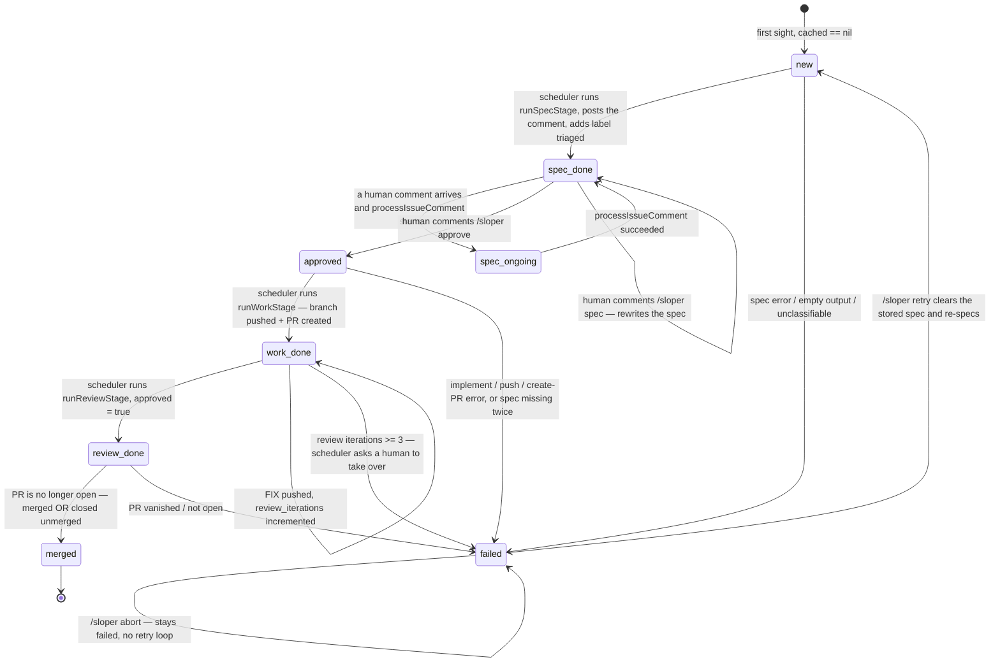
```mermaid
stateDiagram-v2
    [*] --> new : first sight, cached == nil
    new --> spec_done : scheduler runs runSpecStage, posts the comment, adds label triaged
    new --> failed : spec error / empty output / unclassifiable
    spec_done --> spec_ongoing : a human comment arrives and processIssueComment starts
    spec_ongoing --> spec_done : processIssueComment succeeded
    spec_done --> approved : human comments /sloper approve
    spec_done --> spec_done : human comments /sloper spec — rewrites the spec
    approved --> work_done : scheduler runs runWorkStage — branch pushed + PR created
    approved --> failed : implement / push / create-PR error, or spec missing twice
    work_done --> review_done : scheduler runs runReviewStage, approved = true
    work_done --> work_done : FIX pushed, review_iterations incremented
    work_done --> failed : review iterations >= 3 — scheduler asks a human to take over
    review_done --> merged : PR is no longer open — merged OR closed unmerged
    review_done --> failed : PR vanished / not open
    merged --> [*]
    failed --> new : /sloper retry clears the stored spec and re-specs
    failed --> failed : /sloper abort — stays failed, no retry loop
```

**Ground truth.** The literal column values are `new`, `spec-ongoing`,
`spec-done`, `approved`, `work-done`, `review-done`, `merged`, `failed`
(`internal/models/const.go`), and the dashboard's `lib/stages.ts` mirrors them.
`spec-ongoing` is only written by the comment-triage path. There is **no
automatic merge**: `GithubGateway.MergePR` exists but nothing calls it — a human
merges on GitHub, and the scheduler notices on a later tick
(`processReviewDoneIssues` or the not-open guard in `runReviewStage`) and moves
the issue to `merged`, marking the cached issue state `closed` and deleting all
of that issue's session files. `MaxReviewIterations = 3`: a fourth review
attempt posts "Maximum review iterations (3) reached. Please review manually."
and sets the issue to `failed`.

---

## 7. Stage pipeline and the review → fix loop

```mermaid
flowchart LR
    subgraph DISCOVER["Discovery"]
        I["Open issue"] --> P1["processOne"]
    end

    subgraph SPEC["SPEC stage"]
        P1 --> S1["buildSpecPrompt:<br/>title, body, labels,<br/>entire conversation,<br/>plus previous spec when rewriting"]
        S1 --> S2["pi session sloper-issue-N-spec<br/>cwd = repo root"]
        S2 --> S3["parseSpecResult:<br/>summary, files_to_change,<br/>implementation_plan"]
        S3 --> S4["store spec_json,<br/>post 'Sloper Spec Analysis' comment,<br/>label triaged"]
    end

    S4 --> GATE{"Human comments<br/>/sloper approve ?"}
    GATE -->|"no / spec"| S1
    GATE -->|"abort"| FAIL["stage = failed"]
    GATE -->|"yes"| W1

    subgraph WORK["WORK stage"]
        W1["CreateWithBranch<br/>sloper/issue-N-slug from default branch"] --> W2["ImplementFix in worktree<br/>session sloper-issue-N-work"]
        W2 --> W3{"branch already had commits?"}
        W3 -->|"yes"| W6
        W3 -->|"no"| W4["agent edits, tests, commits"]
        W4 --> W6["CommitAll if dirty<br/>push -u origin branch"]
        W6 --> W7["CreatePR + UpsertPR<br/>stage = work-done"]
    end

    W7 --> R1

    subgraph REVIEW["REVIEW stage"]
        R1["GetPR → HeadSHA;<br/>CreateAtCommit review-N-pr-M detached"] --> R2["GetPRDiff (gh pr diff)"]
        R2 --> R3["ReviewPR<br/>session sloper-issue-N-review"]
        R3 --> R4{"approved?"}
    end

    R4 -->|"true"| DONE["stage = review-done<br/>comment 'Self-review passed'"]
    R4 -->|"false, has issues or suggestions"| F1
    R4 -->|"false with zero issues"| FAIL2["run failed: invalid review"]

    subgraph FIX["FIX stage"]
        F1["Post review comment,<br/>CreateWithBranch branch_fix,<br/>fetch origin branch,<br/>reset --hard origin/branch"] --> F2["FixReviewIssues<br/>session sloper-issue-N-fix-ITER"]
        F2 --> F3{"changes produced?"}
        F3 -->|"no"| F4["iterations++ , run failed<br/>avoids a no-op push"]
        F3 -->|"yes"| F5["CommitAll, push HEAD:branch,<br/>iterations++, stage = work-done"]
    end

    F5 -->|"next tick re-reviews, until iterations reach 3"| R1
    DONE --> HUMAN["Human reviews and merges on GitHub<br/>— nothing in sloper merges a PR"]
    HUMAN --> MERGED["tick notices the PR is no longer open →<br/>stage = merged, sessions deleted<br/>(an unmerged close lands here too)"]

    FAIL3["any stage error → run failed,<br/>stage = failed, failure comment on the issue"]
    SPEC -.-> FAIL3
    WORK -.-> FAIL3
    REVIEW -.-> FAIL3
    FIX -.-> FAIL3
```

**Ground truth.** Each stage runs `pi` with its own deterministic session id
(`sloper-issue-N-spec`, `-work`, `-review`, `-fix-<iteration>`), so a rerun
resumes the same transcript, and `spec` is the only session deleted on approve
(`cleanupSpecSession`). WORK resumes: if the branch already has commits ahead of
the base, the implementation step is skipped entirely and the run goes straight
to push + PR. The FIX worktree is a *new* branch `<branch>_fix` that is reset
hard to `origin/<branch>`, and the result is pushed as `HEAD:<branch>`, so the
PR branch is updated in place. Every worktree is removed in a `defer` at the end
of its stage. The loop is bounded only by `review_iterations >= 3`.

---

## 8. Agent RPC session — one stage, one `pi` process

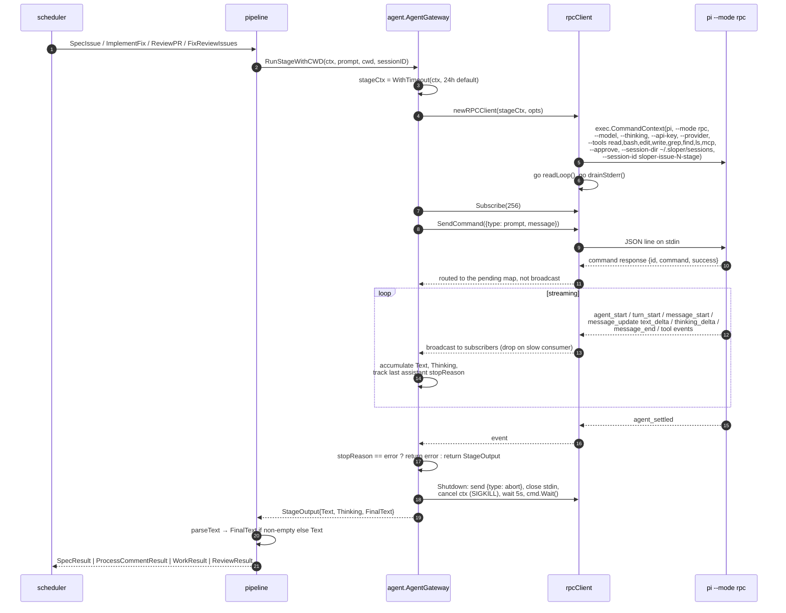
```mermaid
sequenceDiagram
    autonumber
    participant S as scheduler
    participant P as pipeline
    participant G as agent.AgentGateway
    participant C as rpcClient
    participant PI as pi --mode rpc

    S->>P: SpecIssue / ImplementFix / ReviewPR / FixReviewIssues
    P->>G: RunStageWithCWD(ctx, prompt, cwd, sessionID)
    G->>G: stageCtx = WithTimeout(ctx, 24h default)
    G->>C: newRPCClient(stageCtx, opts)
    C->>PI: exec.CommandContext(pi, --mode rpc,<br/>--model, --thinking, --api-key, --provider,<br/>--tools read,bash,edit,write,grep,find,ls,mcp,<br/>--approve, --session-dir ~/.sloper/sessions,<br/>--session-id sloper-issue-N-stage)
    C->>C: go readLoop(), go drainStderr()
    G->>C: Subscribe(256)
    G->>C: SendCommand({type: prompt, message})
    C->>PI: JSON line on stdin
    PI-->>C: command response {id, command, success}
    C-->>G: routed to the pending map, not broadcast
    loop streaming
        PI-->>C: agent_start / turn_start / message_start /<br/>message_update text_delta / thinking_delta /<br/>message_end / tool events
        C-->>G: broadcast to subscribers (drop on slow consumer)
        G->>G: accumulate Text, Thinking,<br/>track last assistant stopReason
    end
    PI-->>C: agent_settled
    C-->>G: event
    G->>G: stopReason == error ? return error : return StageOutput
    G->>C: Shutdown: send {type: abort}, close stdin,<br/>cancel ctx (SIGKILL), wait 5s, cmd.Wait()
    G-->>P: StageOutput{Text, Thinking, FinalText}
    P->>P: parseText → FinalText if non-empty else Text
    P-->>S: SpecResult | ProcessCommentResult | WorkResult | ReviewResult
```

**Ground truth.** The transport is newline-delimited JSON in both directions,
never SDK-in-process. `frameReader` avoids `bufio.Scanner` on purpose because
Scanner splits on U+2028/U+2029, which are legal inside JSON strings. Command
responses are matched by `id` into a pending map and are *not* delivered to
subscribers; everything else is broadcast, with slow consumers dropped rather
than blocked. Two independent stop conditions end a stage: `agent_settled`, or
the process dying / ctx expiring — both return an error path that the scheduler
turns into a `*.failed` run plus a GitHub failure comment. If the last assistant
message settled with `stopReason == "error"`, the gateway returns an error
carrying the provider's `errorMessage` instead of an empty success. Shutdown is
deliberately multi-step: `abort` command → 200 ms → close stdin → cancel context
→ 5 s grace → `Process.Kill()`. `RunStagePersist`, `Steer` and `Abort` on the
gateway are stubs returning "not implemented".

---

## 9. From prompt to typed result — the parsing contract

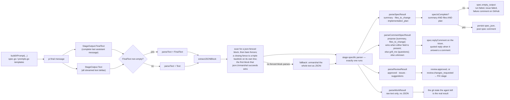
```mermaid
flowchart LR
    A["buildXPrompt(...)<br/>spec.go / prompts.go templates"] --> B["pi final message"]
    B --> C["StageOutput.FinalText<br/>(complete last assistant message)"]
    B --> D["StageOutput.Text<br/>(all streamed text deltas)"]
    C --> E{"FinalText non-empty?"}
    D --> E
    E -->|"yes"| F["parseText = FinalText"]
    E -->|"no"| G["parseText = Text"]
    F --> H["extractJSONBlock"]
    G --> H
    H --> I["scan for a json-fenced block, then bare fences;<br/>a closing fence is a triple backtick on its own line;<br/>the first block that json.Unmarshal succeeds wins"]
    I --> J["stage-specific parser — exactly one runs"]
    I -->|"no fenced block parses"| I2["fallback: unmarshal the whole text as JSON"]
    I2 --> J
    J --> K["parseSpecResult<br/>summary · files_to_change · implementation_plan"]
    J --> L["parseCommentSpecResult<br/>propose {summary, files_to_change}<br/>wins when either field is present;<br/>else grill_me {questions}; else unknown"]
    J --> M["parseReviewResult<br/>approved · issues · suggestions"]
    J --> N["parseWorkResult<br/>raw text only, no JSON"]
    K --> O["specIsComplete?<br/>summary AND files AND plan"]
    O -->|"no"| P["spec.empty_output:<br/>run failed, issue failed,<br/>failure comment on GitHub"]
    O -->|"yes"| Q["persist spec_json,<br/>post spec comment"]
    L --> R["spec.replyComment on the issue,<br/>quoted reply when it answers a comment"]
    M --> S["review.approved, or<br/>review.changes_requested → FIX stage"]
    N --> T["the git state the agent left<br/>is the real result"]
```

**Ground truth.** `FinalText` exists precisely because `Text` accumulates
deltas across *every* turn including tool narration; the JSON parsers read
`FinalText` when it is non-empty. `WorkResult` is never parsed from JSON — the
WORK stage's value is the git state it leaves behind, so `parseWorkResult`
only wraps the raw output. `parseSpecResult` falls back to the first line of the
text (max 120 chars) when no `summary` field survives, and the scheduler then
rejects it with `specIsComplete` if any of the three fields is empty, emitting
`spec.empty_output` and a `/sloper retry` hint comment. The REVIEW stage has a
mirror rule: `approved == false` with zero issues *and* zero suggestions is
treated as an invalid review and fails the run rather than looping.

---

## 10. Domain model

The domain is two layers: the rows that persist, and the in-memory results and
read models built on top of them. They are split into two diagrams because the
combined one was large enough that GitHub's Mermaid renderer refused it.

### 10a. Persistence records — one class per table

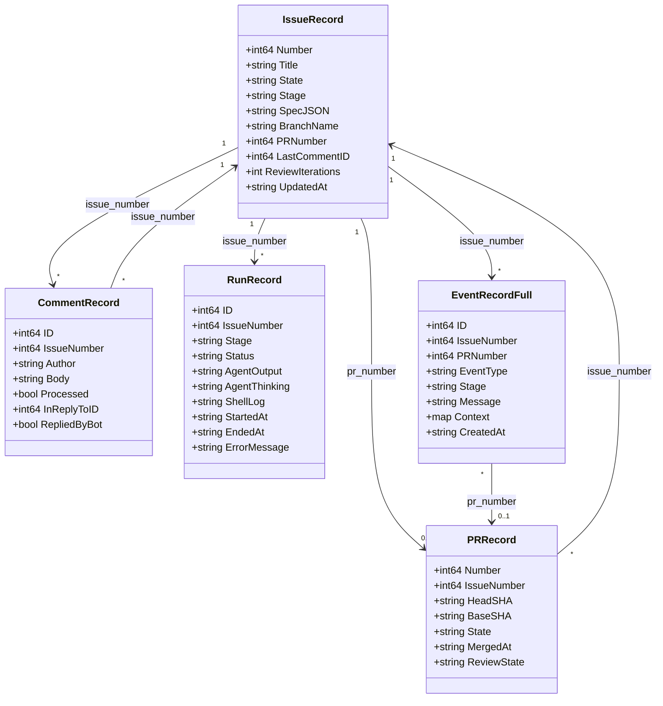
```mermaid
classDiagram
    class IssueRecord {
        +int64 Number
        +string Title
        +string State
        +string Stage
        +string SpecJSON
        +string BranchName
        +int64 PRNumber
        +int64 LastCommentID
        +int ReviewIterations
        +string UpdatedAt
    }
    class CommentRecord {
        +int64 ID
        +int64 IssueNumber
        +string Author
        +string Body
        +bool Processed
        +int64 InReplyToID
        +bool RepliedByBot
    }
    class PRRecord {
        +int64 Number
        +int64 IssueNumber
        +string HeadSHA
        +string BaseSHA
        +string State
        +string MergedAt
        +string ReviewState
    }
    class RunRecord {
        +int64 ID
        +int64 IssueNumber
        +string Stage
        +string Status
        +string AgentOutput
        +string AgentThinking
        +string ShellLog
        +string StartedAt
        +string EndedAt
        +string ErrorMessage
    }
    class EventRecordFull {
        +int64 ID
        +int64 IssueNumber
        +int64 PRNumber
        +string EventType
        +string Stage
        +string Message
        +map Context
        +string CreatedAt
    }

    IssueRecord "1" --> "*" CommentRecord : issue_number
    IssueRecord "1" --> "*" RunRecord : issue_number
    IssueRecord "1" --> "*" EventRecordFull : issue_number
    IssueRecord "1" --> "0..1" PRRecord : pr_number
    CommentRecord "*" --> "1" IssueRecord : issue_number
    PRRecord "*" --> "1" IssueRecord : issue_number
    EventRecordFull "*" --> "0..1" PRRecord : pr_number
```

### 10b. Stage results and read models

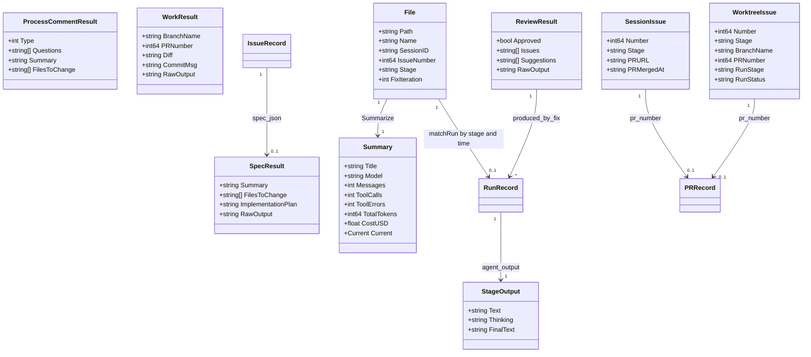
```mermaid
classDiagram
    class SpecResult {
        +string Summary
        +string[] FilesToChange
        +string ImplementationPlan
        +string RawOutput
    }
    class ProcessCommentResult {
        +int Type
        +string[] Questions
        +string Summary
        +string[] FilesToChange
    }
    class WorkResult {
        +string BranchName
        +int64 PRNumber
        +string Diff
        +string CommitMsg
        +string RawOutput
    }
    class ReviewResult {
        +bool Approved
        +string[] Issues
        +string[] Suggestions
        +string RawOutput
    }
    class StageOutput {
        +string Text
        +string Thinking
        +string FinalText
    }
    class WorktreeIssue {
        +int64 Number
        +string Stage
        +string BranchName
        +int64 PRNumber
        +string RunStage
        +string RunStatus
    }
    class SessionIssue {
        +int64 Number
        +string Stage
        +string PRURL
        +string PRMergedAt
    }
    class File {
        +string Path
        +string Name
        +string SessionID
        +int64 IssueNumber
        +string Stage
        +int FixIteration
    }
    class Summary {
        +string Title
        +string Model
        +int Messages
        +int ToolCalls
        +int ToolErrors
        +int64 TotalTokens
        +float CostUSD
        +Current Current
    }

    IssueRecord "1" --> "0..1" SpecResult : spec_json
    RunRecord "1" --> "1" StageOutput : agent_output
    File "1" --> "0..1" RunRecord : matchRun by stage and time
    File "1" --> "1" Summary : Summarize
    ReviewResult "1" --> "*" RunRecord : produced_by_fix
    SessionIssue "1" --> "0..1" PRRecord : pr_number
    WorktreeIssue "1" --> "0..1" PRRecord : pr_number
```

*Reading these two diagrams: the label on each arrow is the join key or the
embedded blob, not a business verb — `spec_json` is a JSON column,
`agent_output` is the persisted text of a run, and `matchRun by stage and time`
is a heuristic the web server applies because sessions are files, not rows.
`ProcessCommentResult`, `WorkResult` and `ReviewResult` are in-memory stage
outputs with no table of their own; their text ends up in `runs.agent_output`
and their effect in the git state or the GitHub comment. `IssueRecord`,
`RunRecord` and `PRRecord` appear in both diagrams as the anchors the read
models hang off.*

**Ground truth.** `SpecResult` lives in two places: in memory in
`internal/models`, and serialised into `issues.spec_json` (its `RawOutput` is
`json:"-"`, so it never hits the database). `StageOutput.Text` /
`.Thinking` are accumulated into `runs.agent_output` / `agent_thinking` — but
`CompleteRun` is always called with thinking and shell log empty strings, so
`agent_thinking` and `shell_log` are effectively dead columns today. `RunRecord`
statuses are `running`, `completed`, `failed`, `interrupted`. `WorktreeIssue`
and `SessionIssue` are read-only projections that join `issues` to
`pull_requests` (and, for worktrees/sessions, to the latest `runs` row) — they
are not tables.

---

## 11. Worktree lifecycle

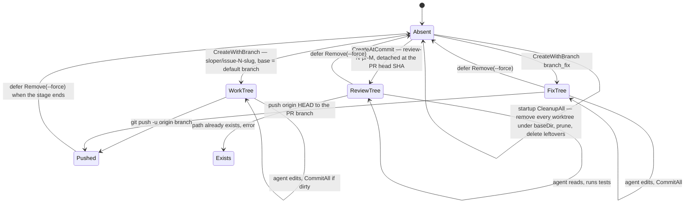
```mermaid
stateDiagram-v2
    [*] --> Absent
    Absent --> WorkTree : CreateWithBranch — sloper/issue-N-slug, base = default branch
    WorkTree --> WorkTree : agent edits, CommitAll if dirty
    WorkTree --> Pushed : git push -u origin branch
    Pushed --> Absent : defer Remove(--force) when the stage ends

    Absent --> ReviewTree : CreateAtCommit — review-N-pr-M, detached at the PR head SHA
    ReviewTree --> ReviewTree : agent reads, runs tests
    ReviewTree --> Absent : defer Remove(--force)
    ReviewTree --> Exists : path already exists, error

    Absent --> FixTree : CreateWithBranch branch_fix
    FixTree --> FixTree : fetch origin branch, reset --hard origin/branch
    FixTree --> FixTree : agent edits, CommitAll
    FixTree --> Pushed : push origin HEAD to the PR branch
    FixTree --> Absent : defer Remove(--force)

    Absent --> Absent : startup CleanupAll — remove every worktree under baseDir, prune, delete leftovers
```

*Only `CreateAtCommit` errors when the path exists: `CreateWithBranch` force
removes a stale directory first, which is why a crashed run can retry. The
`Pushed` marker is a fact about the remote branch, not on-disk state — the
worktree itself is still deleted by the stage's `defer`. Worktrees live under
`~/.sloper/worktrees`: work checkouts sit one level deeper
(`sloper/issue-42-slug`, because the branch name contains a slash) while review
checkouts are flat (`review-42-pr-118`).*

**Ground truth.** The base directory is `~/.sloper/worktrees`
(`worktree.DefaultBaseDir()`), overridable for the API server only via
`SLOPER_WORKTREE_DIR`. Work worktrees sit one level deeper
(`sloper/issue-42-slug`) because the branch name contains a slash; review
worktrees are flat (`review-42-pr-118`). `internal/worktree/scan.go` parses
those two shapes back into `(kind, issue, pr)`, with `_fix` marking the fix
variant, and reports `KindUnknown` for leftovers. Cleanup happens twice:
per stage in a `defer`, and once at startup via `CleanupAll`, which lists
worktrees with `--porcelain`, force-removes anything under the base dir,
prunes, then deletes any remaining directories. `runtime.Start` and
`scheduler.Start` each construct their own `worktree.Manager` — the source has
an explicit comment questioning that duplication.

---

## 12. Git and GitHub command surface

Split in two: the GitHub side is a `gh` subprocess per call with classification
but **no retry**, the git side is a `git` subprocess per call with a real retry
policy.

### 12a. GitHub — every call is a `gh` subprocess

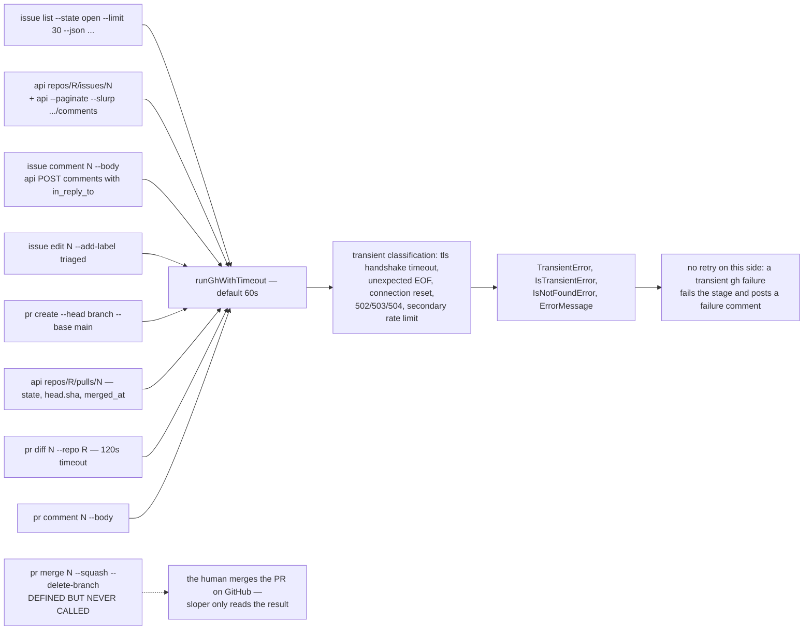
```mermaid
flowchart LR
    GH1["issue list --state open --limit 30 --json ..."]
    GH2["api repos/R/issues/N<br/>+ api --paginate --slurp .../comments"]
    GH3["issue comment N --body<br/>api POST comments with in_reply_to"]
    GH4["issue edit N --add-label triaged"]
    GH5["pr create --head branch --base main"]
    GH6["api repos/R/pulls/N — state, head.sha, merged_at"]
    GH7["pr diff N --repo R — 120s timeout"]
    GH8["pr comment N --body"]
    GH9["pr merge N --squash --delete-branch<br/>DEFINED BUT NEVER CALLED"]

    TO["runGhWithTimeout — default 60s"]
    TR["transient classification: tls handshake timeout,<br/>unexpected EOF, connection reset,<br/>502/503/504, secondary rate limit"]
    ERR["TransientError, IsTransientError,<br/>IsNotFoundError, ErrorMessage"]
    NR["no retry on this side: a transient gh failure<br/>fails the stage and posts a failure comment"]
    HUMAN["the human merges the PR on GitHub —<br/>sloper only reads the result"]

    GH1 --> TO
    GH2 --> TO
    GH3 --> TO
    GH4 --> TO
    GH5 --> TO
    GH6 --> TO
    GH7 --> TO
    GH8 --> TO
    GH9 -.-> HUMAN
    TO --> TR --> ERR --> NR
```

### 12b. Git — every call is a `git` subprocess

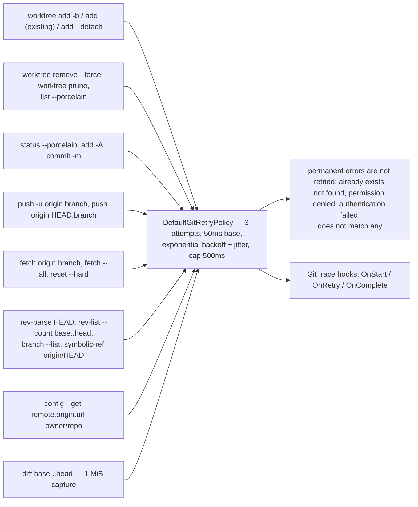
```mermaid
flowchart LR
    G1["worktree add -b / add (existing) / add --detach"]
    G2["worktree remove --force, worktree prune,<br/>list --porcelain"]
    G3["status --porcelain, add -A, commit -m"]
    G4["push -u origin branch, push origin HEAD:branch"]
    G5["fetch origin branch, fetch --all, reset --hard"]
    G6["rev-parse HEAD, rev-list --count base..head,<br/>branch --list, symbolic-ref origin/HEAD"]
    G7["config --get remote.origin.url — owner/repo"]
    G8["diff base...head — 1 MiB capture"]

    RP["DefaultGitRetryPolicy — 3 attempts, 50ms base,<br/>exponential backoff + jitter, cap 500ms"]
    PERM["permanent errors are not retried: already exists,<br/>not found, permission denied, authentication failed,<br/>does not match any"]
    TRC["GitTrace hooks: OnStart / OnRetry / OnComplete"]

    G1 --> RP
    G2 --> RP
    G3 --> RP
    G4 --> RP
    G5 --> RP
    G6 --> RP
    G7 --> RP
    G8 --> RP
    RP --> PERM
    RP --> TRC
```

**Ground truth.** Nothing in this project talks to the GitHub API directly:
`gh` is the only client, so auth is whatever `gh auth` has (in Docker:
`gh auth setup-git` plus `GH_TOKEN`). `MergePR` is genuinely unreachable — the
scheduler never merges; the human does. The git layer is the only place with a
retry policy, and it distinguishes permanent from transient failures by
substring matching on the error text, wrapping the final failure in
`GitRetryError` with every attempt recorded. Output capture is bounded
(256 KiB default, 1 MiB for diffs) by `BoundedBuffer`, and every shell
invocation is logged through `logShellCommand` with exit code, duration and
truncated stdout/stderr.

---

## 13. SQLite schema

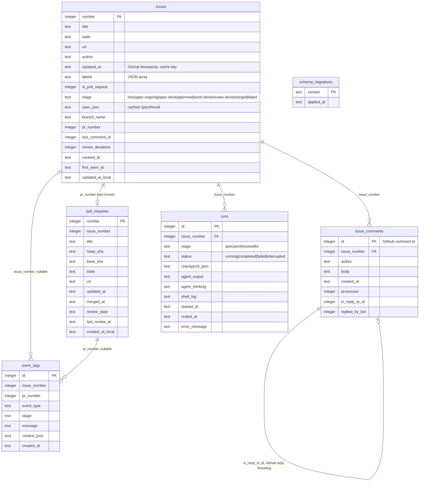
```mermaid
erDiagram
    issues {
        integer number PK
        text title
        text state
        text url
        text author
        text updated_at "GitHub timestamp, cache key"
        text labels "JSON array"
        integer is_pull_request
        text stage "new|spec-ongoing|spec-done|approved|work-done|review-done|merged|failed"
        text spec_json "cached SpecResult"
        text branch_name
        integer pr_number
        integer last_comment_id
        integer review_iterations
        text created_at
        text first_seen_at
        text updated_at_local
    }
    issue_comments {
        integer id PK "GitHub comment id"
        integer issue_number FK
        text author
        text body
        text created_at
        integer processed
        integer in_reply_to_id
        integer replied_by_bot
    }
    pull_requests {
        integer number PK
        integer issue_number
        text title
        text head_sha
        text base_sha
        text state
        text url
        text updated_at
        text merged_at
        text review_state
        text last_review_at
        text created_at_local
    }
    runs {
        integer id PK
        integer issue_number FK
        text stage "spec|work|review|fix"
        text status "running|completed|failed|interrupted"
        text checkpoint_json
        text agent_output
        text agent_thinking
        text shell_log
        text started_at
        text ended_at
        text error_message
    }
    event_logs {
        integer id PK
        integer issue_number
        integer pr_number
        text event_type
        text stage
        text message
        text context_json
        text created_at
    }
    schema_migrations {
        text version PK
        text applied_at
    }

    issues ||--o{ issue_comments : "issue_number"
    issues ||--o{ runs : "issue_number"
    issues ||--o| pull_requests : "pr_number links loosely"
    issues ||--o{ event_logs : "issue_number, nullable"
    pull_requests ||--o{ event_logs : "pr_number, nullable"
    issue_comments ||--o| issue_comments : "in_reply_to_id, GitHub reply threading"
```

*Only two of these are declared foreign keys (`issue_comments.issue_number`,
`runs.issue_number`); everything else is a loose integer join the code performs
by hand. There is no repo/owner column anywhere — one database is one repo, by
design. Indexes exist for `issue_comments(issue_number)`,
`issue_comments(issue_number, processed)`, `pull_requests(issue_number)`,
`runs(issue_number)`, `runs(status)`, `event_logs(issue_number)` and
`event_logs(event_type)`; the ER diagram omits them because they carry no
semantics.*

**Ground truth.** Three migrations, applied in filename order inside one
transaction each, tracked in `schema_migrations`: `0001_init.sql` (all five
tables + indexes), `0002_comment_replies.sql` (adds `in_reply_to_id`,
`replied_by_bot`), `0003_pr_merge_meta.sql` (adds `merged_at`). The database is
opened with `_pragma=journal_mode(WAL)`, `foreign_keys(ON)`,
`busy_timeout(5000)`, `synchronous(NORMAL)` and `SetMaxOpenConns(1)`. Only
`issue_comments.issue_number` and `runs.issue_number` declare a real foreign
key; `pull_requests.issue_number` is a plain column, and `event_logs` has no FK
at all. `event_logs.context_json` is written as `{}` because no caller ever sets
`EventRecord.Context`. The default path is `~/.sloper/sloper.sqlite`
(`SLOPER_DB_PATH` overrides it); the console reports
`page_count * page_size` as `db_size`.

---

## 14. Runs and events — recovery plus audit

```mermaid
flowchart LR
    subgraph RUNLIFE["one stage = one row in runs"]
        R1["StartRun(issue, stage)<br/>status = running, started_at = now"] --> R2["stage work happens"]
        R2 -->|"success"| R3["CompleteRun(id, rawOutput, '', '')<br/>status = completed, ended_at"]
        R2 -->|"error"| R4["FailRun(id, message)<br/>status = failed, ended_at, error_message"]
        R2 -->|"process killed"| R5["row stays running"]
    end

    subgraph RECOVERY["next startup: runtime.runRecovery"]
        R5 --> C1["MarkRunsInterrupted:<br/>UPDATE runs SET status = 'interrupted'<br/>WHERE status = 'running'"]
        C1 --> C2["GetInterruptedRuns"]
        C2 --> C3["for each: log + AppendEvent<br/>recovery.interrupted_run<br/>'will retry on next tick'"]
    end

    subgraph EVENTS["event_logs taxonomy"]
        direction TB
        E0["tick.started · tick.failed · tick.completed"]
        E1["spec.started · spec.completed · spec.failed ·<br/>spec.empty_output · spec.unclassified_response ·<br/>spec.rerun_received · spec.replyComment"]
        E2["approve.received · abort.received · retry.received"]
        E3["work.started · work.completed · work.failed"]
        E4["review.started · review.approved · review.failed ·<br/>review.changes_requested · review.max_iterations ·<br/>review.invalid"]
        E5["fix.started · fix.completed · fix.failed · fix.no_changes"]
        E6["cleanup.sessions_deleted · recovery.interrupted_run"]
    end

    R3 --> EVENTS
    R4 --> EVENTS
    C3 --> EVENTS
```

**Ground truth.** Every stage brackets itself with `StartRun` and either
`CompleteRun` or `FailRun`; the only argument ever passed for thinking and shell
log is `""`. There is no cancel state: `/sloper abort` moves the *issue* to
`failed` and deletes its sessions, but a run already in flight finishes
normally, and `abort.received` / `retry.received` are events, not run states.
`MarkRunsInterrupted` is a blanket `UPDATE` with no owner or heartbeat guard —
safe only because one sloper process owns one database.

A run that never finishes (SIGKILL, host reboot) is left
`running` and is the *only* signal recovery uses — `runRecovery` runs before
the scheduler starts, so an interrupted stage is not silently retried but is
recorded and picked up by the normal tick logic. Events are the console's audit
trail: `GET /api/events` pages them newest-first, `GET
/api/issues/N/events` returns one issue's timeline, and
`GET /api/metrics/activity?hours=N` buckets them by hour for the chart. The
console additionally derives "last tick" from the newest `tick.started` and the
following `tick.completed`.

---

## 15. `sloper-web` API surface

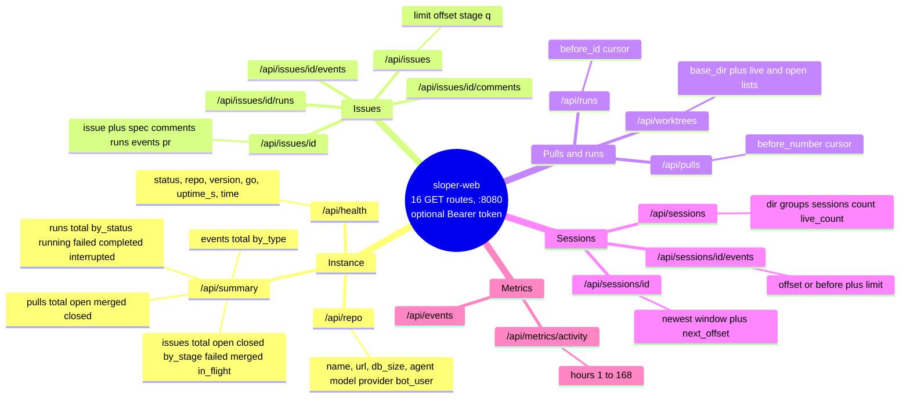
```mermaid
mindmap
  root(("sloper-web<br/>16 GET routes, :8080<br/>optional Bearer token"))
    Instance
      /api/health
        status, repo, version, go, uptime_s, time
      /api/repo
        name, url, db_size, agent model provider bot_user
      /api/summary
        issues total open closed by_stage failed merged in_flight
        runs total by_status running failed completed interrupted
        pulls total open merged closed
        events total by_type
    Issues
      /api/issues
        limit offset stage q
      /api/issues/id
        issue plus spec comments runs events pr
      /api/issues/id/comments
      /api/issues/id/runs
      /api/issues/id/events
    Pulls and runs
      /api/pulls
        before_number cursor
      /api/runs
        before_id cursor
      /api/worktrees
        base_dir plus live and open lists
    Sessions
      /api/sessions
        dir groups sessions count live_count
      /api/sessions/id
        newest window plus next_offset
      /api/sessions/id/events
        offset or before plus limit
    Metrics
      /api/events
      /api/metrics/activity
        hours 1 to 168
```

**Ground truth.** 16 routes, all registered with `GET` method patterns on a
`http.ServeMux` (`app/web/main.go`). Middleware order is `cors(auth(mux))`, so
preflight `OPTIONS` is answered before the token check; CORS is
`Access-Control-Allow-Origin: *` with `Authorization` and `X-Instance-Id`
allowed. Auth is a shared bearer token (`SLOPER_WEB_TOKEN`) compared with
`subtle.ConstantTimeCompare`, and is disabled when the variable is empty. The
server binds `SLOPER_WEB_ADDR` (default `127.0.0.1`) + `SLOPER_WEB_PORT`
(default `8080`), applies its own migrations at startup, and holds a single
SQLite handle. Pagination is `limit` (default 100, max 5000) + `offset`, with
`before_id` / `before_number` cursors for runs/events/pulls. `/api/worktrees`
is the only route that mixes a directory scan with database rows; `/api/repo`
exposes the sanitised agent env (`model`, `provider`, `bot_user`, `repo_env`) and
never the API key. Errors are `{"error": "..."}`; the sessions-events route
returns `{"error": ..., "gone": true}` with 404 when the file was deleted.

---

## 16. Console architecture

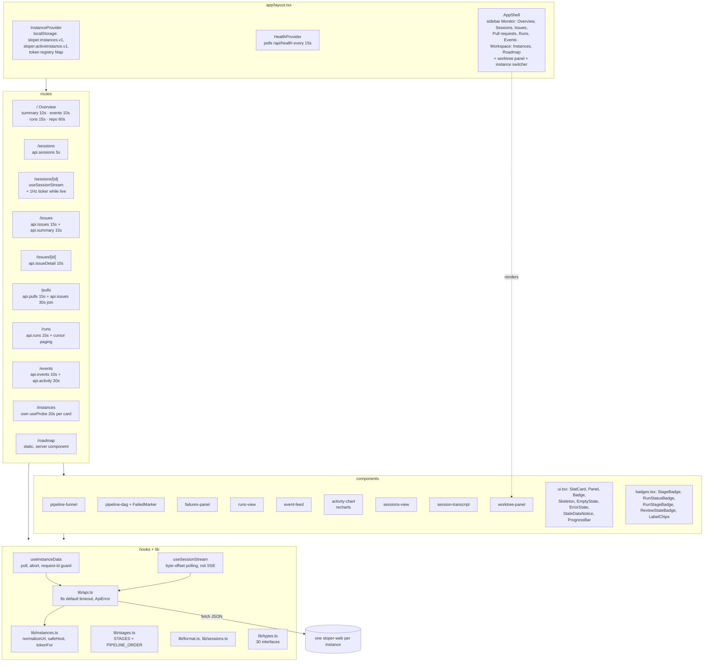
```mermaid
flowchart TD
    subgraph ROOT["app/layout.tsx"]
        IP["InstanceProvider<br/>localStorage: sloper.instances.v1,<br/>sloper.activeInstance.v1,<br/>token registry Map"]
        HP["HealthProvider<br/>polls /api/health every 15s"]
        SHELL["AppShell<br/>sidebar Monitor: Overview, Sessions, Issues,<br/>Pull requests, Runs, Events ·<br/>Workspace: Instances, Roadmap<br/>+ worktree panel + instance switcher"]
    end

    subgraph PAGES["routes"]
        P1["/ Overview<br/>summary 10s · events 10s · runs 15s · repo 60s"]
        P2["/sessions<br/>api.sessions 5s"]
        P3["/sessions/[id]<br/>useSessionStream<br/>+ 1Hz ticker while live"]
        P4["/issues<br/>api.issues 15s + api.summary 15s"]
        P5["/issues/[id]<br/>api.issueDetail 10s"]
        P6["/pulls<br/>api.pulls 15s + api.issues 30s join"]
        P7["/runs<br/>api.runs 15s + cursor paging"]
        P8["/events<br/>api.events 10s + api.activity 30s"]
        P9["/instances<br/>own useProbe 20s per card"]
        P10["/roadmap<br/>static, server component"]
    end

    subgraph COMPONENTS["components"]
        C1["pipeline-funnel"]
        C2["pipeline-dag + FailedMarker"]
        C3["failures-panel"]
        C4["runs-view"]
        C5["event-feed"]
        C6["activity-chart<br/>recharts"]
        C7["sessions-view"]
        C8["session-transcript"]
        C9["worktree-panel"]
        C10["ui.tsx: StatCard, Panel, Badge,<br/>Skeleton, EmptyState, ErrorState,<br/>StaleDataNotice, ProgressBar"]
        C11["badges.tsx: StageBadge, RunStatusBadge,<br/>RunStageBadge, ReviewStateBadge, LabelChips"]
    end

    subgraph LIB["hooks + lib"]
        H1["useInstanceData<br/>poll, abort, request-id guard"]
        H2["useSessionStream<br/>byte-offset polling, not SSE"]
        L1["lib/api.ts<br/>8s default timeout, ApiError"]
        L2["lib/instances.ts<br/>normalizeUrl, safeHost, tokenFor"]
        L3["lib/stages.ts<br/>STAGES + PIPELINE_ORDER"]
        L4["lib/format.ts, lib/sessions.ts"]
        L5["lib/types.ts<br/>30 interfaces"]
    end

    ROOT --> PAGES
    PAGES --> COMPONENTS
    PAGES --> LIB
    COMPONENTS --> LIB
    SHELL -.->|"renders"| C9
    H1 --> L1
    H2 --> L1
    L1 --> L2
    L1 -->|"fetch JSON"| API[("one sloper-web per instance")]
```

*Every `api.<name>` in the route list is a method of the `api` object in
`lib/api.ts`, and each one maps to exactly one route from diagram 15 (for
example `api.summary` → `GET /api/summary`).*

**Ground truth.** Next.js `^15.3.3` App Router only (no `pages/`, no route
handlers, no middleware, no rewrites — the browser fetches the Go API
cross-origin), React 19, TypeScript strict, Tailwind 4 configured entirely in
`globals.css` `@theme` (no `tailwind.config.*`), Recharts 3, lucide,
`output: 'standalone'`. Only `app/layout.tsx`, `app/roadmap/page.tsx`,
`components/page-header.tsx` and `components/raven-logo.tsx` are server
components, and none of them fetch data — every data page is `'use client'`.
`app/layout.tsx` wraps every page in `InstanceProvider` → `HealthProvider` →
`AppShell`; the shell owns the sidebar (`Monitor`: Overview, Sessions, Issues,
Pull requests, Runs, Events · `Workspace`: Instances, Roadmap), the sticky
header with the instance switcher (portal-rendered on desktop, inline in the
mobile drawer), the worktree panel, the theme toggle, and the `aria-live`
connection status. Pages call `useInstanceData(fetcher, intervalMs, enabled,
deps)`, which keeps the previous snapshot on same-instance refreshes, clears it
when the instance changes, and drops late responses by request id.

Polling cadences (production): health 15 s shared via `HealthProvider`;
worktrees 5 s while any worktree is live else 30 s; overview summary + events
10 s, runs 15 s, repo 60 s; issues 15 s + summary 15 s; issue detail 10 s;
pulls 15 s + an issues join 30 s; runs 15 s; events 10 s + activity 30 s;
sessions list 5 s; session transcript 1.5 s live / 6 s idle; instance cards
20 s each. The instance registry and its bearer tokens are persisted in
`localStorage` under `sloper.instances.v1` (`sloper.activeInstance.v1` for the
selection, `sloper-theme` and `sloper-sidebar-collapsed` for chrome); the
default instance is `NEXT_PUBLIC_SLOPER_DEFAULT_URL` or
`http://localhost:8080`. Requests carry `Authorization: Bearer <token>` only
when a token is registered; timeouts are 8 s by default, 5 s health, 6 s
worktrees, 12 s sessions. The console is read-only: it never POSTs to a sloper
instance, and the only "actions" are local (instance CRUD, theme, filters,
cursors).

---

## 17. Session streaming protocol

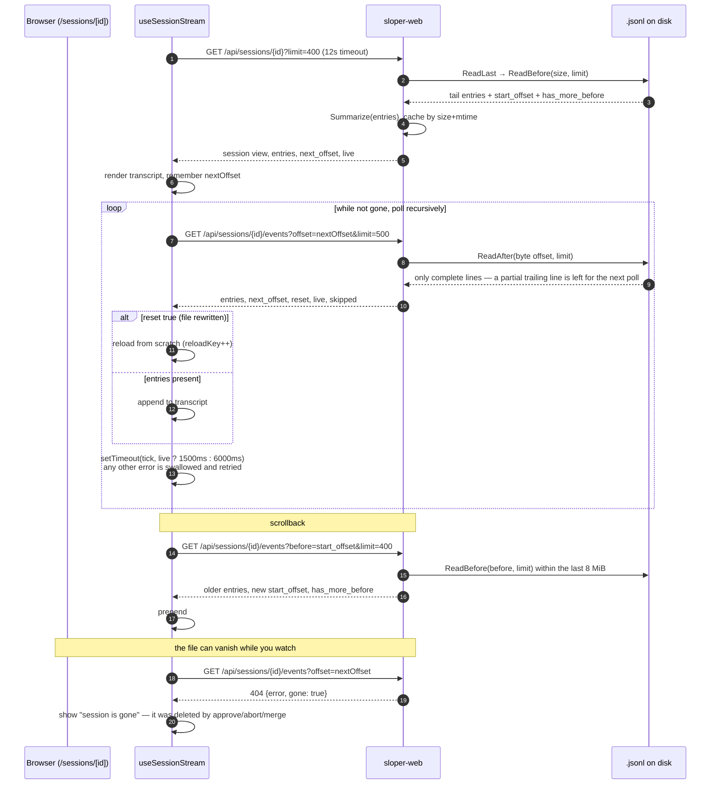
```mermaid
sequenceDiagram
    autonumber
    participant B as Browser (/sessions/[id])
    participant H as useSessionStream
    participant A as sloper-web
    participant F as .jsonl on disk

    H->>A: GET /api/sessions/{id}?limit=400 (12s timeout)
    A->>F: ReadLast → ReadBefore(size, limit)
    F-->>A: tail entries + start_offset + has_more_before
    A->>A: Summarize(entries), cache by size+mtime
    A-->>H: session view, entries, next_offset, live
    H->>H: render transcript, remember nextOffset

    loop while not gone, poll recursively
        H->>A: GET /api/sessions/{id}/events?offset=nextOffset&limit=500
        A->>F: ReadAfter(byte offset, limit)
        F-->>A: only complete lines — a partial trailing line is left for the next poll
        A-->>H: entries, next_offset, reset, live, skipped
        alt reset true (file rewritten)
            H->>H: reload from scratch (reloadKey++)
        else entries present
            H->>H: append to transcript
        end
        H->>H: setTimeout(tick, live ? 1500ms : 6000ms)<br/>any other error is swallowed and retried
    end

    Note over H,A: scrollback
    H->>A: GET /api/sessions/{id}/events?before=start_offset&limit=400
    A->>F: ReadBefore(before, limit) within the last 8 MiB
    A-->>H: older entries, new start_offset, has_more_before
    H->>H: prepend

    Note over B,A: the file can vanish while you watch
    H->>A: GET /api/sessions/{id}/events?offset=nextOffset
    A-->>H: 404 {error, gone: true}
    H->>H: show "session is gone" — it was deleted by approve/abort/merge
```

**Ground truth.** There is no websocket and no SSE: the transcript is a byte
cursor over a JSONL file, polled by the browser. The server never re-reads the
whole file for updates — `ReadAfter` seeks to the offset and stops at the last
complete newline, so a partially written line is picked up by the next poll.
`ReadBefore` windows backwards, capped at 8 MiB per read, and drops the first
(probably truncated) line of a mid-file window. Entries longer than 4 MiB and
lines that fail to parse are counted in `skipped` rather than failing the
request. `reset` is returned when the requested offset is past EOF (the file was
replaced or forked) and the client restarts from zero. `live` is true when the
file changed within 120 s, or when the matched pipeline run is still `running`
and younger than 30 minutes. Polling is a recursive `setTimeout`, not an
interval, so a slow response cannot stack requests. The transcript view supports
"load earlier" driven by `has_more_before`.

---

## 18. Session files → summary → "what is it doing right now"

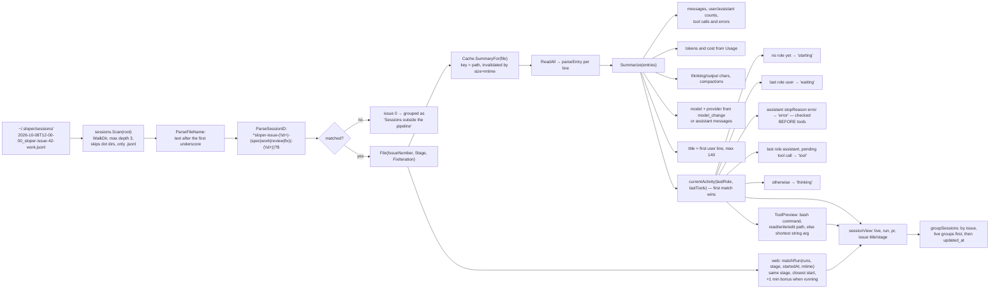
```mermaid
flowchart LR
    A["~/.sloper/sessions/<br/>2026-10-08T12-00-00_sloper-issue-42-work.jsonl"] --> B["sessions.Scan(root)<br/>WalkDir, max depth 3,<br/>skips dot dirs, only .jsonl"]
    B --> C["ParseFileName:<br/>text after the first underscore"]
    C --> D["ParseSessionID:<br/>^sloper-issue-(\\d+)-(spec|work|review|fix)(-(\\d+))?$"]
    D --> E{"matched?"}
    E -->|"no"| E1["issue 0 → grouped as<br/>'Sessions outside the pipeline'"]
    E -->|"yes"| F["File{IssueNumber, Stage, FixIteration}"]

    F --> G["Cache.SummaryFor(file)<br/>key = path, invalidated by size+mtime"]
    G --> H["ReadAll → parseEntry per line"]
    H --> I["Summarize(entries)"]
    I --> I1["messages, user/assistant counts,<br/>tool calls and errors"]
    I --> I2["tokens and cost from Usage"]
    I --> I3["thinking/output chars, compactions"]
    I --> I4["model + provider from model_change<br/>or assistant messages"]
    I --> I5["title = first user line, max 140"]
    I --> J["currentActivity(lastRole, lastTools) — first match wins"]
    J --> J1["no role yet → 'starting'"]
    J --> J2["last role user → 'waiting'"]
    J --> J4["assistant stopReason error → 'error' — checked BEFORE tools"]
    J --> J3["last role assistant, pending tool call → 'tool'"]
    J --> J5["otherwise → 'thinking'"]
    J --> K["ToolPreview: bash command,<br/>read/write/edit path, else shortest string arg"]
    J --> M
    K --> M

    F --> L["web: matchRun(runs, stage, startedAt, mtime)<br/>same stage, closest start,<br/>+1 min bonus when running"]
    L --> M["sessionView: live, run, pr, issue title/stage"]
    M --> N["groupSessions: by issue,<br/>live groups first, then updated_at"]
```

**Ground truth.** The file name *is* the metadata: sloper hands pi a
deterministic `--session-id`, so `sloper-issue-42-fix-2` yields issue 42, stage
`fix`, iteration 2 with no bookkeeping table. `Summarize` is O(n) and cached by
(size, mtime); `Retain` drops cache entries for files that disappeared. The
"current activity" heuristic relies on pi writing the assistant message (with
its tool calls) *before* the tools run: an assistant tool call with no matching
`toolResult` means that tool is running now. Matching a session to a `runs` row
is a heuristic too — same stage, nearest start time, with a one-minute bonus for
a still-running run and a 24-hour penalty for a run that started more than two
minutes after the file's last write. `Summary.TotalTokens`/`CostUSD` come from
the provider-reported `usage` blocks.

---

## 19. Build, validate and pre-PR tooling

```mermaid
flowchart LR
    subgraph BUILD["Makefile"]
        M1["build-sloper → dist/sloper"]
        M2["build-all → go build ./..."]
        M3["build-web → dist/sloper-web"]
        M4["build-dashboard → npm install + next build"]
        M5["dashboard-install (only when node_modules/.bin/next is missing)"]
        M6["run-dashboard → next start :3000"]
        M7["dev-dashboard → next dev"]
        M8["build-docker → binaries into setup/ + docker compose build"]
        M9["docker / docker-up / docker-down / docker-clean"]
        M10["format-check → gofmt -l ."]
        M11["lint → go vet ./..."]
        M12["evaluate-design → node scripts/evaluate-design.mjs"]
        M13["pre-pr-diagrams → tools/pre-pr-diagrams.sh brief"]
    end

    M1 --> FLAGS["tools/go-build-flags:<br/>git describe --tags --always --dirty<br/>→ -X version.Version"]
    M2 --> FLAGS
    M3 --> FLAGS
    M8 --> FLAGS
    FLAGS --> VER["internal/version.Version (default 'dev')"]
    M5 -.-> M4
    TESTS -.->|"never invoked by validate.sh"| VALIDATE

    subgraph VALIDATE["validate.sh — smoke test each layer"]
        V0["0 prerequisites: go, gh, pi, git"]
        V1["1 build sloper to /tmp/sloper-test"]
        V2["2 go vet ./internal/..."]
        V3["3 gh auth status"]
        V4["4 git remote of the repo"]
        V5["5 ANTHROPIC_API_KEY / OPENAI_API_KEY present?"]
        V6["6 pipe a prompt into pi --mode rpc, 5s timeout,<br/>count output lines"]
        V7["7 print run instructions"]
        V0 --> V1 --> V2 --> V3 --> V4 --> V5 --> V6 --> V7
    end

    subgraph PREPR["tools/pre-pr-diagrams.sh + .agents/skills"]
        PP1["writes .pre-pr/branch/{brief,author-prompt,<br/>verify-prompt,diff.patch}"]
        PP2["skill pre-pr-diagrams:<br/>before/after diagrams verified by a second agent"]
        PP3["skill sloper-design-review:<br/>static checks + Chrome MCP screenshots + scorecard"]
    end

    subgraph TESTS["go test ./... — 7 packages"]
        TP["app/web · internal/agent · internal/pipeline ·<br/>internal/scheduler · internal/sessions ·<br/>internal/slash · internal/worktree"]
    end
```

**Ground truth.** `make build-sloper` and `build-web` inject the version via
`-ldflags "$(go run ./tools/go-build-flags)"`; without it the version string is
`dev`. The dashboard targets are defensive: `dashboard-install` only runs
`npm install` when `node_modules/.bin/next` is absent, and `run-dashboard`
builds only when `.next/BUILD_ID` is missing. `validate.sh` is a *manual*
smoke test (it is not wired into CI) and is deliberately tolerant: `gh auth`,
the git remote and the API key are warnings, not failures. Its step 6 pipes a
bare `{"type":"prompt",...}` line into `pi --mode rpc` — the same transport the
scheduler uses — and only checks that more than three lines come back. Tests
exist for seven packages; `go vet ./...` is clean. The `.pre-pr/` directory
holds the generated artefacts for the `feat-spec-full-rewrite` branch, and
`tools/pre-pr-diagrams.sh` is the hook that produces them.

---

## 20. Configuration map

```mermaid
flowchart LR
    subgraph ENV["environment variables"]
        E1["GH_TOKEN"]
        E2["GH_USERNAME"]
        E3["GH_EMAIL"]
        E4["GH_REPO_LINK"]
        E5["AGENT_MODEL"]
        E6["AGENT_KEY"]
        E7["AGENT_PROVIDER"]
        E8["AGENT_API (reserved)"]
        E9["SLOPER_DB_PATH"]
        E10["SLOPER_SESSION_DIR"]
        E11["SLOPER_WORKTREE_DIR"]
        E12["SLOPER_WEB_ADDR / SLOPER_WEB_PORT"]
        E13["SLOPER_WEB_TOKEN"]
        E14["SLOPER_REPO"]
        E15["NEXT_PUBLIC_SLOPER_DEFAULT_URL"]
        E16["CLOUDFLARED_TOKEN"]
        E17["PRE_PR_AUTHOR_CMD<br/>PRE_PR_VERIFY_CMD<br/>PRE_PR_MAX_ROUNDS"]
    end

    subgraph CONSUMER["consumer"]
        C1["gh CLI (auth)"]
        C2["scheduler.BotUser<br/>own comments are not re-answered"]
        C3["setup/script.sh → git config --global"]
        C4["setup/script.sh clone target"]
        C5["agent gateway → pi --model<br/>(+ --thinking high always)"]
        C6["agent gateway → pi --api-key"]
        C7["agent gateway → pi --provider"]
        C8["not wired: custom base URL"]
        C9["storage.OpenDB default ~/.sloper/sloper.sqlite"]
        C10["pi --session-dir and the web sessions view"]
        C11["worktree manager + web scan dir"]
        C12["sloper-web listen address"]
        C13["sloper-web bearer auth"]
        C14["sloper-web repo label"]
        C15["console default instance URL"]
        C16["cloudflared tunnel profile"]
        C17["tools/pre-pr-diagrams.sh run loop"]
    end

    E1 --> C1
    E2 --> C2
    E3 --> C3
    E4 --> C4
    E5 --> C5
    E6 --> C6
    E7 --> C7
    E8 --> C8
    E9 --> C9
    E10 --> C10
    E11 --> C11
    E12 --> C12
    E13 --> C13
    E14 --> C14
    E15 --> C15
    E16 --> C16
    E17 --> C17

    NOTE["Nothing loads .env automatically.<br/>Root .env.example is for local runs<br/>(set -a; . ./.env; set +a),<br/>setup/.env is loaded by compose env_file."] -.-> ENV
```

**Ground truth.** This diagram shows *who reads* each variable, not defaults or
requiredness. The defaults, in one line each: `SLOPER_DB_PATH` →
`~/.sloper/sloper.sqlite`, `SLOPER_SESSION_DIR` → `~/.sloper/sessions`,
`SLOPER_WORKTREE_DIR` → `~/.sloper/worktrees`, `SLOPER_WEB_ADDR` →
`127.0.0.1` (forced to `0.0.0.0` by compose), `SLOPER_WEB_PORT` → `8080`,
`SLOPER_REPO` → the git remote of the server's CWD else `unknown-repo`,
`NEXT_PUBLIC_SLOPER_DEFAULT_URL` → `http://localhost:8080`. Everything else
defaults to the empty string, which means: `SLOPER_WEB_TOKEN` empty disables
auth, `AGENT_MODEL` empty makes every stage fail, `GH_USERNAME` empty disables
bot-comment detection, and `AGENT_API` empty is indistinguishable from set —
nothing reads it. `PRE_PR_AUTHOR_CMD`, `PRE_PR_VERIFY_CMD` and
`PRE_PR_MAX_ROUNDS` (E17) are consumed by `tools/pre-pr-diagrams.sh run`, not by
the Go binaries, and default to unset / `3`.

The two .env templates serve different entry points: the root
`.env.example` documents running `./dist/sloper` + `./dist/sloper-web` from a
checkout, and `setup/.env.example` documents the compose deployment (it is
loaded with `env_file`). `.env` at the repo root currently contains only
`GH_TOKEN=""` and `MODEL_KEY=""` — note `MODEL_KEY` is not read by any code;
the agent key variable is `AGENT_KEY`. `AGENT_MODEL` is required in practice
(nothing defaults it), and thinking is not configurable at all — the scheduler
hardcodes `Thinking: "high"`. `SLOPER_SESSION_DIR` and `SLOPER_WORKTREE_DIR` are
read **only by `sloper-web`**: the scheduler always writes to
`$HOME/.sloper/sessions` and `$HOME/.sloper/worktrees`, so those variables exist
to let a server in a different container point at the worker's directories.
`SLOPER_WEB_TOKEN` is optional; when set, every route requires
`Authorization: Bearer <token>` (the console stores that token in
`localStorage`).

---

## 21. Operator journey

```mermaid
journey
    title Who does what — Maintainer versus Sloper
    section File
      Open a GitHub issue describing the bug: 5: Maintainer
      Comment follow-ups or corrections: 4: Maintainer
    section Spec
      Sloper posts the Spec Analysis comment: 5: Sloper
      Read summary, files to change, plan: 3: Maintainer
      Comment /sloper spec to rewrite it: 3: Maintainer
      Comment /sloper approve: 5: Maintainer
    section Work
      Sloper implements in a worktree and opens a PR: 5: Sloper
      Watch the live transcript in the console: 4: Maintainer
    section Review loop
      Sloper self-reviews the diff: 5: Sloper
      Sloper pushes fixes, up to 3 iterations: 4: Sloper
      Step in when the iteration cap is hit: 2: Maintainer
    section Land
      Review the PR and merge it on GitHub: 4: Maintainer
      Sloper marks the issue merged and clears sessions: 5: Sloper
```

*The score is Mermaid's satisfaction scale (0–5) and is illustrative, not a
measurement: it encodes how much attention each step demands of the human. Every
step tagged `Sloper` is automatic once the preceding human step happens.*

**Ground truth.** The human keeps three levers, all as issue comments:
`/sloper spec` (rewrite), `/sloper approve` (start implementation), `/sloper
abort`, plus `/sloper retry` after a failure and `/sloper status`. Everything
else is automatic: discovery, spec, implementation, PR creation, self-review and
fix pushes. The merge itself is manual by design in the current code — the
`/sloper approve` gate and the human merge are the two control points the README
calls out ("semi-auto, requires permission before implementation").

---

## 22. How the repo got here

```mermaid
timeline
    title Sloper milestones (68 commits, curated highlights)
    section June 2026
        2026-06-17 : repository initialised
    section July 2026
        2026-07-02 : Stage 1 scope written down (Stage1.md)
        2026-07-13 : validate.sh smoke test
        2026-07-14 : git/github/shell gateways + SQLite schema
    section August 2026
        2026-08-03 : README restructured around GitHub as the hub
    section September 2026
        2026-09-24 : Apple-inspired Liquid Glass console pass
        2026-09-25 : UI review findings addressed
        2026-09-30 : worktree sidebar panel + harness-inspired console
    section October 2026
        2026-10-07 : initial dashboard merged (PR 13)
        2026-10-08 : live session viewer API + console (PR 21)
        2026-10-08 : migration framework restored after the PR 21 merge
        2026-10-08 : spec rewritten from the whole conversation (PR 24)
        2026-10-08 : pre-PR diagram hook (PR 25)
        2026-10-08 : docs/env templates + optional Cloudflare tunnel
```

*This is a curated narrative, not a commit listing: 15 dated milestones stand in
for 68 commits, so quiet stretches are not evidence of inactivity. The five
2026-10-08 entries are in commit order, not timestamp order. PR numbers 14–20
and 22–23 are simply not shown.*

**Ground truth.** `git log` shows 68 commits between 2026-06-17 and
2026-10-08. The shape of the history matters for reading the code: the Go
orchestrator came first (gateways, storage, scheduler), the Next.js console
arrived later and drove the newest work (sessions view, worktree panel, design
system), and the most recent commits are documentation, tooling and deployment
polish. Two merge mishaps are visible in the log and are reflected in
comments in the source: the migration framework was lost in the #21 merge and
restored in `d91d34c`, and `.pre-pr/feat-spec-full-rewrite/` still holds the
artefacts of the spec-rewrite branch.

---

## Known gaps and rough edges (read these before trusting the code)

1. **Nothing merges PRs automatically.** `GithubGateway.MergePR` is dead code;
   the README's "Merges PRs" claim is aspirational. The scheduler only *notices*
   a merge.
2. **`runs.agent_thinking` and `runs.shell_log` are always empty** —
   `CompleteRun` is called with `""` for both, so the API's `thinking` field on
   a run never has content (the live transcript view is where thinking lives).
3. **`event_logs.context_json` is always `{}`** — no caller populates
   `EventRecord.Context`.
4. **`spec-ongoing` is written by exactly one path** (comment triage) and is
   a terminal-looking state in the funnel; the console's funnel pins the
   review "ongoing" counter to 0 with a comment saying the reviewing stage is
   not exposed yet.
5. **Two `worktree.Manager` instances exist** (runtime and scheduler) and the
   source comments ask why — `runtime.Start` calls `CleanupAll` and then the
   scheduler builds its own manager.
6. **Retry only exists for git.** GitHub transient errors are *classified*
   (`TransientError`, `IsTransientError`) but no caller retries them; a
   transient `gh` failure simply fails the stage and posts a failure comment.
7. **`MODEL_KEY` in the root `.env` is not read anywhere**; the real variable is
   `AGENT_KEY`.
8. **Instance bearer tokens live in `localStorage`** alongside the instance
   list (`sloper.instances.v1`), in plain text.
9. **The `pi` binary path is not configurable** in the running scheduler:
   `AgentOptions.BinaryPath` defaults to `"pi"` and no env var sets it.
10. **`validate.sh` is not run by anything** — there is no CI configuration in
    the repo (`.github/` does not exist).
11. **Three API routes are served but unused by the console**:
    `GET /api/issues/{n}/comments`, `/runs` and `/events` — the issue detail
    endpoint already returns comments, runs and events in one payload, and
    `lib/api.ts` never calls the per-issue sub-routes.
12. **`dashboard/README.md` describes a worktree sidebar that no longer
    exists** — it claims two sections ("Working now" / "Open work"), while
    `worktree-panel.tsx` merges both into one deduped list capped at 8 rows.
    The design guide also says "20 px collapsed rail" where the code uses
    `w-20` (80 px).
13. **The funnel and the DAG disagree on shape.** The overview funnel renders
    5 cards (New, Spec = `spec-ongoing` + `spec-done`, Working = `approved` +
    `work-done`, Review, Merged) plus a red Failed chip, and its Review card
    pins the "ongoing" count to 0 with a comment that the reviewing stage is not
    exposed yet. The issue detail DAG renders all 7 `PIPELINE_ORDER` nodes and
    never a Failed node — a failed issue paints the *first* node red.
14. **`RUN_STAGES` includes `merge`** in the console filter, and the database
    comment on `runs.stage` lists `merge`, but no code ever starts a merge run.
15. **Missing spec rule asymmetry:** the funnel filters `spec-ongoing` for the
    Spec card but `approved` for Working, so a click on "Spec" does not show
    issues sitting in `spec-done`.
16. **`/api/health` hardcodes `version: "dev"`** even when the binary was built
    with ldflags; only the startup banner and `--version` report the real
    version.
17. **"Read-only" is not literally read-only.** `sloper-web` opens the database
    (creating the directory, file and WAL) and runs migrations, which write
    `schema_migrations`. It is read-only with respect to issues, runs and PRs —
    not with respect to the filesystem.
18. **There is no `repo`/`owner` column anywhere.** One SQLite file is one
    repository; two instances pointed at the same database would collide on
    issue and PR numbers.
19. **`setup/.env` in this working tree contains what look like live
    credentials** (a GitHub PAT and a provider key) and is gitignored but
    present. Anyone who has read that file — including an agent — should treat
    those tokens as compromised and rotate them. The root `.env` has the same
    shape with empty values.
20. **`dist/sloper` in this checkout is a stale build that does not implement
    `--version`** — running it with that flag starts the whole scheduler
    instead. Rebuild before demoing anything.
21. **Two `setup/` binaries are committed to git** (`setup/sloper` ≈13 MB,
    `setup/sloper-web` ≈15 MB, ≈28 MB of history) so `docker compose build`
    works without a Go toolchain, at the cost of a repository that carries
    build output.
22. **`setup/.env.example` documents fewer variables than the deployment
    needs** — it omits `SLOPER_WEB_PORT`, `SLOPER_WEB_TOKEN`,
    `SLOPER_WEB_ADDR`, `SLOPER_DB_PATH`, `SLOPER_SESSION_DIR` and
    `SLOPER_REPO`, all of which `setup/README.md` tells you to set in that
    file. `SLOPER_WORKTREE_DIR` is documented in the root template as where
    worktrees are *created*, but only `sloper-web` reads it.
23. **The console polls the active instance twice**: `HealthProvider` every
    15 s for the shell, and the `/instances` page's own `useProbe` every 20 s
    per card.
24. **`lib/api.ts` declares `has_more_before` on the session-events response,
    but the server only sends it on the session-detail response** — the field
    is always `undefined` on the polling path.
25. **`validate.sh` cannot pass on a machine without `pi`**: step 0 requires
    `go`, `gh`, `pi` and `git` and exits immediately, and it never runs
    `go test`, never builds `app/web`, and vets only `./internal/...`.
26. **The root `README` (no extension) and `Stage1.md` predate the shipped
    system.** The README describes a queue, a future admin web app and
    "containerize later"; `Stage1.md` says agent outputs and tool calls are not
    logged, which the Sessions view contradicts.

---

## Validation log

Every diagram above was validated the same way: an independent subagent that had
**no access to the repository** was given one diagram and asked to describe what
it understood — system, components, flow, concrete details, gaps. The
description was then checked against the ground truth in the source. Diagram
text was corrected and re-rendered wherever the description exposed a real
error. The table records the outcome; "questions" are things the validator
flagged that are true of the system rather than faults in the diagram.

Two changes came *after* this validation and are not reflected in the rows
below: diagrams 10 and 12 were split and 11 was trimmed so that GitHub's Mermaid
renderer would accept them (the source text was getting large; the claims are
unchanged), and one sequence-diagram message in 17 lost a semicolon, which
GitHub's parser treats as a statement separator.

| # | Diagram | Understood correctly? | Errors found and fixed | Questions raised (answered in the ground truth) |
| --- | --- | --- | --- | --- |
| 1 | System context | Yes | Console was drawn inside the worker container; gh edges read as read-only; no poll arrow; localStorage placement | — |
| 2 | Go package graph | Yes | Self-edge on `internal/sessions` contradicted its own "no internal deps" label; arrow semantics unstated | How app/web relates to the orchestrator (it shares only storage/sessions/worktree) |
| 3 | Runtime topology | Yes | `npm start` was drawn as the browser; `script.sh` vs `/setup.sh` naming; `~/repo` vs `/root/repo`; tunnel profile name | Base image, node version, restart policy, shared volume |
| 4 | Scheduler tick loop | Yes | Passes looked per-issue rather than post-loop batches | Where stage transitions happen (diagram 6), error handling of a failed issue |
| 5 | `processOne` triage tree | Yes | The "already processed" branch looked like it re-scanned instead of advancing | `stage = new` does not set `last_comment_id`; only the last comment is parsed |
| 6 | Issue stage machine | Yes | **`spec-ongoing` had no inbound transition (unreachable)**; "closed or merged" implied an unmerged close is a merge; no actors on triggers | Counters not modelled; `approved` the state vs `approved` the verdict |
| 7 | Stage pipeline + fix loop | Yes | Missing iteration cap; no failure edges; unmerged-close nuance | Who merges (added explicitly) |
| 8 | Agent RPC session | Yes | — | Process exit code never inspected; slow-consumer drops; abort to a dead process |
| 9 | Output parsing | Yes | All four parsers hung off one unlabelled node; propose/grill rule missing; `spec.empty_output` names emptiness but means incompleteness | Which parser runs when (one per stage) |
| 10 | Domain model | Yes | Missing `EventRecordFull → PRRecord`, `PRRecord → IssueRecord`, `CommentRecord → IssueRecord` edges | Labels are join keys; `StageOutput` is persisted as run text |
| 11 | Worktree lifecycle | Yes | **`Pushed` and `Exists` were dangling states with no exit** | Who deletes a worktree after a push (the stage `defer`) |
| 12 | Git + GitHub surface | Yes | **The gh side looked like it retried; it does not** — added an explicit no-retry node and the human merger | `not found` is both a permanent substring and `IsNotFoundError` |
| 13 | SQLite schema | Yes | Missing `issue_comments → issue_comments` self-reference | Indexes are omitted; only two real FKs; no repo column |
| 14 | Runs and events | Yes | — | No cancel state; blanket interrupted UPDATE |
| 15 | Web API surface | Yes | Root did not state auth or the route count | Methods per route, defaults, sort order, error shapes |
| 16 | Console architecture | Yes | `useSessionStream` could be read as a real stream; worktree panel had no owner edge | `api.*` → endpoint mapping, poll jitter |
| 17 | Session streaming | Yes | **`offset=next` never defined byte offsets**; the 404 was drawn as a push rather than a poll response; missing swallow-and-retry path | `skipped` is returned but unused by the hook |
| 18 | Session summary pipeline | Yes | **Precedence was wrong: `error` is checked before pending tools**; activity and tool preview had no edge to the session view | Tie-breaking in `matchRun`; malformed lines |
| 19 | Build + tooling | Yes | Only one build target was wired to the version flags (four use them) | `validate.sh` runs neither tests nor the dashboard builds |
| 20 | Configuration map | Yes | Pre-PR variables were missing | Defaults and requiredness (now in the ground truth) |
| 21 | Operator journey | Yes | **Every step was attributed to the maintainer, including sloper's own work** | Score meaning (illustrative satisfaction) |
| 22 | Repo timeline | Yes | A July date was filed under the June section; the title implied a complete commit list | Ordering within 2026-10-08; unlisted PRs |

Net result: 22 of 22 diagrams were understood at the level of actors, flow and
concrete details — no validator came away with a materially wrong model of the
system. 19 diagrams were still revised: **seven** of those revisions fixed
something the diagram stated incorrectly (the console's location in two
diagrams, the actor attribution in the journey, the branch precedence in the
session activity heuristic, a misfiled date, an unreachable state, and a
self-contradictory edge), and the rest added missing detail (an iteration cap, a
failure path, three missing relationships, a missing environment variable) or
removed ambiguity (undefined offsets, dangling states, unlabelled arrows).
